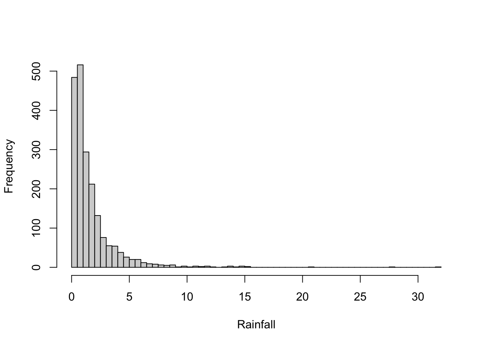
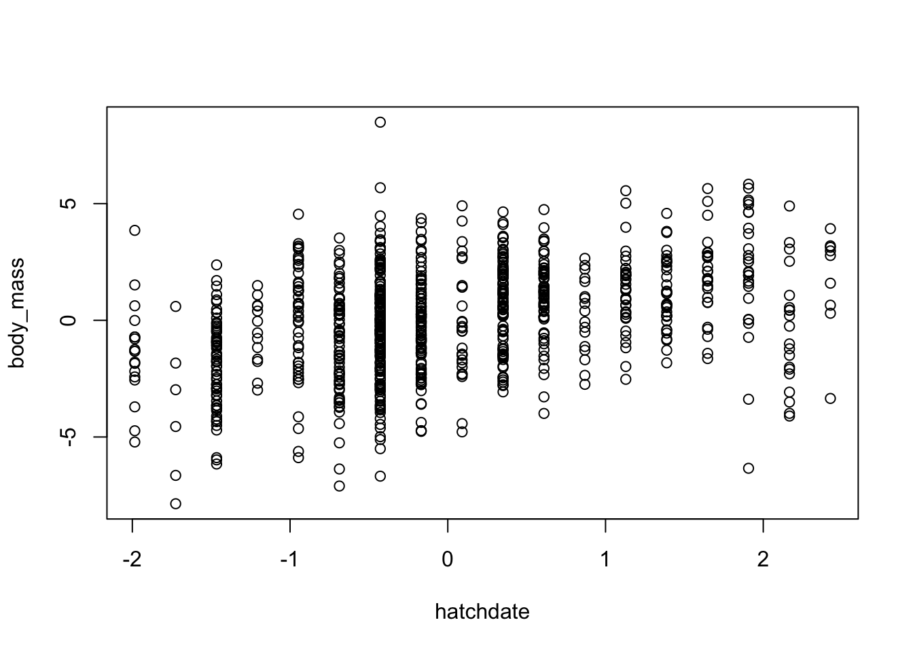

# Simulating from linear models {#linearmod}


In this section, we will look at simulating simple data from linear models, to familiarise ourselves with how {squidSim} works.


## Simple Linear Model

<!-- <div class="panel panel-success">
<div class="panel-heading">
**Biological example**
</div>
<div class="panel-body">
We are interested in how some environmental variables affect adult body mass.  
</div>
</div> -->

We will start simulating data without any hierarchical structure, i.e. everything varies at the level of the *observation*. Let's imagine a situation where body mass is affected by some environmental variables - temperature, rainfall and wind. We can write this out in the form of a linear model: 

$$
y_i = \beta_0 + \beta_1 x_{1i} + \beta_2 x_{2i} + \beta_3 x_{3i} + \epsilon_i
$$

, where each observation (denoted by the index $i$) of our response variable ($y_i$) is the sum of an intercept ($\beta_0$; value of the response when the predictor variables are all 0), the associated value of our predictor variables ($x_{1i}$, $x_{2i}$, $x_{3i}$; which also vary at the level of the observation), each with a certain magnitude and direction of their effect (effect size or slope; $\beta_1$ etc), and some unexplained, residual variation ($\epsilon_i$). 

We can write this in more compact notation, 
$$
y_{i} = \beta_0 + \boldsymbol{x}_{i} \boldsymbol{\beta} + \epsilon_{i}
$$

where $\boldsymbol{x}_{i}$ is a (row) vector of $x_{1i}$, $x_{2i}$ $x_{3i}$ etc, or equivalently row $i$ in the matrix of predictors $X$, 
$$
\boldsymbol{x}_{i} = \begin{bmatrix}
x_{1i} & x_{2i} & x_{3i}
\end{bmatrix}
$$
and $\boldsymbol{\beta}$ is a (column) vector of slopes/effect sizes
$$
\boldsymbol{\beta} = \begin{bmatrix}
\beta_1 \\
\beta_2 \\
\beta_3 
\end{bmatrix}
$$

 We will use this notation throughout the vignette, as it is a bit more compact, relates most easily the structure of the `simulate_population()` function, and can incorporate the flexibility needed for the different model structures.

We assume that these predictor variables are multivariate normally distributed, with given means ($\mu$) and a covariance structure ($\Sigma_x$), and the residuals are normally distributed with a given variance ($\sigma^2_\epsilon$)
$$
\boldsymbol{x}_i \sim \mathcal{N}(\boldsymbol{\mu}_x, \Sigma_x)
$$
$$
\epsilon_i \sim \mathcal{N}(0,\sigma^2_\epsilon)
$$

where $$
\boldsymbol{\mu}_x = \begin{bmatrix}
\mu_{x_1} \\
\mu_{x_2} \\
\mu_{x_3} 
\end{bmatrix}
,
\Sigma_x = \begin{bmatrix}
\sigma^2_{x_1} & \sigma_{x_1x_2} & \sigma_{x_1x_3}\\
\sigma_{x_1x_2} & \sigma^2_{x_2} & \sigma_{x_2x_3}\\
\sigma_{x_1x_3} & \sigma_{x_2x_3} & \sigma^2_{x_3}
\end{bmatrix}
$$


<!-- 
<div class="alert alert-info">


</div>
 -->
The key to simulating data using the `squidSim` package is correctly specifying the parameters (from the equations above that would be $\beta_0$, $\boldsymbol{\beta}$, $\boldsymbol{\mu}_x$, $\Sigma_x$, $\sigma^2_\epsilon$). These parameters are given to the `simulate_population` function as a nested *list*. Within the main parameter list, there are named lists corresponding to different hierarchical levels, containing the parameters for the predictors at that level - here we are just focussing on the observation level (see Section \@ref(hierarchical) for examples with hierarchical structure). Parameters for the residual *must* be specified, all other levels are optional (they revert to defaults values; beta=1, mean=0, vcov=1. In addition to the named lists relating to hierarchical levels, a vector for intercepts and a list for interactions can be added. Intercepts are demonstrated in the examples below, and interactions in Section \@ref(interactions). Many of the components in the parameter list don't need to be specified and default values will be created.

Let's simulate from the above model. 
First, we can specify a sample size or data_structure. As we don't have any hierarchical data structure yet (see Section \@ref(hierarchical)), we have to specify the sample size with the `n` argument to the `simulate_population` function (e.g. 2000).
```r
simulate_population(
  n=2000,
  ...
)
```
We can also give the response ($\boldsymbol{y}$) variable a name, `body_mass` (this is not needed, and defaults to `y` if not specified).
```r
simulate_population(
  n=2000,
  response_name = "body_mass",
  ...
)
```
We then need to add in our parameter list:
```r
simulate_population(
  n=2000,
  response_name = "body_mass",
  parameters = list(
    ...
  )
)
```

<!-- <mark style="background-color: lightblue">Correlated and interacting predictor variables</mark> -->

To fill in our parameter list, lets think about our model
$$
y_{i} = \color{red}{\beta_0}+ \color{blue}{\boldsymbol{x}_{i} \boldsymbol{\beta}} + \color{orange}{\epsilon_{i}}
$$
$$
\boldsymbol{x}_i \sim \mathcal{N}(\boldsymbol{\mu}_x, \Sigma_x)
$$
$$
\epsilon_i \sim \mathcal{N}(0,\sigma^2_\epsilon)
$$
 or in words:


<span style='color: red;'>intercept</span> + <span style='color: blue;'>observation</span> level predictors + <span style='color: orange;'>residual</span>

These names correspond to names in our parameter list. To simulate our environmental predictors that vary at the level of the observation, we can use the `observation`  slot in the parameter list, as well as specifying an intercept and residual variance in the `intercept` and `residual` slots, respectively. 
The global intercept ($\beta_0$) is given by specifying an intercept vector in the parameter list e.g.

```r
    intercept=10
```

For both observation and residual we create a **list** containing the respective parameters. For the observation list, we can specify the names of these variables as a vector (these can be anything - I like giving things actual names, but could also be x1, x2 and x3) and, in the simplest case, the $\beta$ values as a vector.

```r
    observation = list(
      names = c("temperature","rainfall", "wind"),
      beta = c(0.5,-0.3, 0.4)    
    )
```
By default, these predictors are simulated as i.i.d. unit normals (mean=0, var=1, cov=0), so 
$$
\boldsymbol{\mu}_x = \begin{bmatrix}
0 \\
0 \\
0 
\end{bmatrix}
, 
\Sigma_x = \begin{bmatrix}
1 & 0 & 0\\
0 & 1 & 0\\
0 & 0 & 1
\end{bmatrix}
$$

Note that the order of the names and betas has to match. We can then specify the residual variance, here as 0.8 (but can be anything). `vcov` refers to the variance-covariance matrix, which for the residuals is only a single variance until we have multiple response variables (Section \@ref(multivariate)).
```r
    residual = list(
      vcov = 0.8
    )
```
We can then put this all together: 


``` r
squid_data <- simulate_population(
  n=2000,
  response_name = "body_mass",
  parameters = list(
    intercept=10,
    observation = list(
      names = c("temperature","rainfall", "wind"),
      beta = c(0.5,-0.3, 0.4)    
    ),
    residual = list(
      vcov = 0.8
    )
  )
)
```

Let's compare the code back to the model using colors to link equation to code:

$$
y_{i} = \color{red}{\beta_0}+ \color{blue}{\boldsymbol{x}_{i} \boldsymbol{\beta}} + \color{orange}{\epsilon_{i}}
$$
$$
\color{blue}{\boldsymbol{x}_i \sim \mathcal{N}(\boldsymbol{\mu}_x, \Sigma_x)}
$$
$$
\color{orange}{\epsilon_i \sim \mathcal{N}(0,\sigma^2_\epsilon)}
$$


<span style="font-family:Menlo, Monaco, Consolas, Courier New, monospace">
parameters = list(  
&nbsp;&nbsp; <span style='color: red;'>intercept = 10</span>,  
&nbsp;&nbsp; <span style='color: blue;'>observation = list(</span>  
&nbsp;&nbsp;&nbsp;&nbsp; <span style='color: blue;'>names = c("temperature","rainfall", "wind"),</span>  
&nbsp;&nbsp;&nbsp;&nbsp; <span style='color: blue;'>beta = c(0.5,-0.3, 0.4)</span>   
&nbsp;&nbsp; <span style='color: blue;'>)</span>,  
&nbsp;&nbsp; <span style='color: orange;'>residual = list(</span>  
&nbsp;&nbsp;&nbsp;&nbsp; <span style='color: orange;'>vcov = 0.8</span>  
&nbsp;&nbsp; <span style='color: orange;'>)</span>  
)
</span>


This generates a squid object, which when run returns a friendly message:

``` r
squid_data
```

```
## Data simulated using squid 
## 
##               /\             
##              /  \            
##             / /\ \           
##             \/  \/            
##             /    \           
##             |    |          
##             |    |          
##      0      |    |      0     
##      /      \____/      \    
##     {     __/(  )\__     }   
##      \___/__\_\/_/__\___/    
##       / / / /    \ \ \ \     
##      / / / {      } \ \ \    
##     { { /   \    /   \ } }   
##     }  \     0  0     /  {   
##  0_/  { \_0        0_/ }  \_0
##        \              /      
##         }            {       
##        /              \      
##       0                0
```
 and contains all our simulation parameters as well as the simulated data. At this point we want to be able to access the simulated data. There are then some further functions which we can use to access the data and simulation parameters. We can extract the simulated data using `get_population_data()` The generated response is returned, along with simulated predictors and the data structure (not relevant here). 

``` r
data <- get_population_data(squid_data)
head(data)
```

```
##   body_mass temperature     rainfall       wind   residual squid_pop
## 1 10.187011   2.4800342  0.455257003  0.7825594 -1.2294526         1
## 2 10.949223  -0.2569207 -1.474704317  0.3857166  0.4809849         1
## 3 10.845240   0.2189803  1.463922216 -0.8564840  1.5175202         1
## 4  9.916527   0.7198543 -1.037817017  2.3682777 -1.7020568         1
## 5 10.216552   1.7756108 -0.003199892 -0.1130542 -0.6269915         1
## 6 10.054326   1.2120665  0.558004447  0.8376667 -0.7193723         1
```

Later on we will explore how to simulate data for multiple populations with the same parameters (Section \@ref(npop)). `squid_pop` is an identifier for the population number, but is not relevant here.

We can plot what we have simulated:

``` r
library(scales)
par(mfrow=c(1,3))
plot(body_mass ~ temperature + rainfall + wind, data, pch=19, cex=0.5, col=alpha(1,0.5))
```


and run a linear model to check that we get back the betas that we simulated:

``` r
coef(lm(body_mass ~ temperature + rainfall + wind,data))
```

```
## (Intercept) temperature    rainfall        wind 
##   9.9898809   0.4891688  -0.3473308   0.3994893
```

We can also check the means and variances of the predictors


``` r
predictors <- data[,c("temperature","rainfall","wind")]
colMeans(predictors)
```

```
## temperature    rainfall        wind 
##  0.02084866 -0.02319050  0.04471757
```

``` r
cov(predictors)
```

```
##             temperature     rainfall         wind
## temperature  1.03670554 -0.035961509 -0.028953762
## rainfall    -0.03596151  0.978340502 -0.003275084
## wind        -0.02895376 -0.003275084  1.017055449
```


It's worth noting that these values are not *exactly* what we simulated. That is to be expected - simulation involves *randomly* generating data, which means that here will be stochasticity in the simulated sample, and in our estimates of the underlying parameters.
<!-- 
We can extract the parameters we used for the simulations

``` r
# get_parameters(squid_data)
```
 -->

### Adding more information about the predictors

We can also specify the predictors as having different means and variances. In the observation list, `mean` and `vcov` specify the means and covariance matrix of the predictors. If the predictors were uncorrelated, we can just specify the variances as a vector (the diagonal elements of the covariance matrix), and the function assumes the covariances are 0 (see section \@ref(corpred) for correlated predictors). Below we have three predictors, temperature, rainfall and wind, with means 10, 1 and 20 respectively, variances 1, 0.1 and 2, respectively, and betas 0.5,-3 and 0.4, a residual variance 0.8 and a global intercept of 10:

$$
y_{i} = \beta_0+ \boldsymbol{x}_{i} \boldsymbol{\beta} + \epsilon_{i}
$$
$$
\boldsymbol{x}_i \sim \mathcal{N}(\boldsymbol{\mu}_x, \Sigma_x)
$$
$$
\epsilon_i \sim \mathcal{N}(0,\sigma^2_\epsilon)
$$

$$
\color{red}{\beta_0=10}
,
\color{blue}{\boldsymbol{\mu}_x = \begin{bmatrix}
10 \\
1 \\
20 
\end{bmatrix}}
, 
\color{CornflowerBlue}{\Sigma_x = \begin{bmatrix}
1 & 0 & 0\\
0 & 0.1 & 0\\
0 & 0 & 2
\end{bmatrix}}
,
\color{purple}{\boldsymbol{\beta} = \begin{bmatrix}
0.5 \\
-3 \\
0.4 
\end{bmatrix}}
,
\color{orange}{\sigma^2_\epsilon=0.8}
$$


<br><br>
<span style="font-family:Menlo, Monaco, Consolas, Courier New, monospace">
&nbsp;&nbsp; squid_data <- simulate_population(  
&nbsp;&nbsp;&nbsp;&nbsp; n=2000,  
&nbsp;&nbsp;&nbsp;&nbsp; response_name = "body_mass",  
&nbsp;&nbsp;&nbsp;&nbsp;  parameters = list(  
&nbsp;&nbsp;&nbsp;&nbsp;&nbsp;&nbsp; <span style='color: red;'>intercept = 10</span>,  
&nbsp;&nbsp;&nbsp;&nbsp;&nbsp;&nbsp; <span style='color: blue;'>observation = list(</span>  
&nbsp;&nbsp;&nbsp;&nbsp;&nbsp;&nbsp;&nbsp;&nbsp; <span style='color: blue;'>names = c("temperature","rainfall", "wind"),</span>  
&nbsp;&nbsp;&nbsp;&nbsp;&nbsp;&nbsp;&nbsp;&nbsp; <span style='color: blue;'>mean = c(10,1,20),</span>   
&nbsp;&nbsp;&nbsp;&nbsp;&nbsp;&nbsp;&nbsp;&nbsp; <span style='color: CornflowerBlue;'>vcov = c(1,0.1,2),</span>   
&nbsp;&nbsp;&nbsp;&nbsp;&nbsp;&nbsp;&nbsp;&nbsp; <span style='color: purple;'>beta = c(0.5,-0.3, 0.4)</span>   
&nbsp;&nbsp;&nbsp;&nbsp;&nbsp;&nbsp; <span style='color: blue;'>)</span>,  
&nbsp;&nbsp;&nbsp;&nbsp;&nbsp;&nbsp; <span style='color: orange;'>residual = list(</span>  
&nbsp;&nbsp;&nbsp;&nbsp;&nbsp;&nbsp;&nbsp;&nbsp; <span style='color: orange;'>vcov = 0.8</span>  
&nbsp;&nbsp;&nbsp;&nbsp;&nbsp;&nbsp; <span style='color: orange;'>)</span>  
&nbsp;&nbsp;&nbsp;&nbsp; )  
&nbsp;&nbsp; )
</span>


``` r
data <- get_population_data(squid_data)

coef(lm(body_mass ~ temperature + rainfall + wind, data))
```

```
## (Intercept) temperature    rainfall        wind 
##   9.8151163   0.5078401  -3.0425996   0.4088486
```

``` r
library(scales)
par(mfrow=c(1,3))
plot(body_mass ~ temperature + rainfall + wind, data, pch=19, cex=0.5, col=alpha(1,0.5))
```


Again, we can check that the means and variances of the predictors are being simulated as we think they should be


``` r
predictors <- data[,c("temperature","rainfall","wind")]
colMeans(predictors)
```

```
## temperature    rainfall        wind 
##   10.026389    0.984711   19.972831
```

``` r
cov(predictors)
```

```
##             temperature   rainfall        wind
## temperature 1.022800759 0.01207170 0.008560134
## rainfall    0.012071704 0.10157462 0.019360030
## wind        0.008560134 0.01936003 1.988802856
```

It can be complicated to keep up with how these different values combine to give the mean and variance of the response. To help with this, the `simulated_variance()` function calculates the expected mean and variance of the response variable, as well as breaking down the contribution of different predictors and hierarchical levels to the these.

``` r
 simulated_variance(squid_data)
```

```
## Contribution of the simulated predictors to the mean and variance in the response
## 
## Simulated Mean: 20 
## Simulated Variance: 2.27 
## 
## Contribution of different hierarchical levels to grand mean and variance:
##             mean  var
## intercept     10 0.00
## observation   10 1.47
## residual       0 0.80
## 
## 
## Contribution of different predictors to grand mean and variance:
##             mean  var
## intercept     10 0.00
## temperature    5 0.25
## rainfall      -3 0.90
## wind           8 0.32
## residual       0 0.80
```

<!-- {#lm_explain width=100% max-height=2000px} -->


## Correlated predictors {#corpred}
We can also simulate correlations between these predictors, as `vcov` specifies the variance/covariance matrix of the predictors.


``` r
squid_data <- simulate_population(
  n=2000,
  response_name = "body_mass",
  parameters=list(
    intercept=10,
    observation=list(
      names=c("temperature","rainfall", "wind"),
      mean = c(10,1 ,20),
      vcov =matrix(c(
        1, 0, 1,
        0,0.1,0,
        1, 0, 2
        ), nrow=3 ,ncol=3,byrow=TRUE),
      beta =c(0.5,-3,0.4)
    ),
    residual=list(
      vcov=1
    )
  )
)

data <- get_population_data(squid_data)

library(scales)
par(mfrow=c(1,3))
plot(body_mass ~ temperature + rainfall + wind, data, pch=19, cex=0.5, col=alpha(1,0.5))
```


``` r
coef(lm(body_mass ~ temperature + rainfall + wind, data))
```

```
## (Intercept) temperature    rainfall        wind 
##   9.6889225   0.5234006  -3.0645581   0.4075788
```

<style>
div.blue { background-color:#fcba03; border-radius: 5px; padding: 20px;}
</style>
<div class = "blue">
**Matrices in R**

To code a matrix in R we use the `matrix` function (see `?matrix`). This takes a vector of values, and arranges then in a matrix, with dimensions specified with `nrow` and `ncol`. By default it fills the matrix by column, which can be changed to per row, by specifying `byrow=TRUE`. For big matrices this can be petty annoying. The`Tri2M()` function from the package `MCMCglmm` allows you to just give the lower or upper half of the matrix, and it will fill the rest out for you. For example, we can make a correlation matrix using:

``` r
Tri2M(c(1,0.5,1,0.3,0.2,1), lower.tri = FALSE, diag=TRUE)
```

```
##      [,1] [,2] [,3]
## [1,]  1.0  0.5  0.3
## [2,]  0.5  1.0  0.2
## [3,]  0.3  0.2  1.0
```

</div>

<!-- 
https://stackoverflow.com/questions/63007496/how-to-create-an-editable-matrix-in-shiny-app
make little shiny app that allows you to enter diagonal and 

 -->

Instead of specifying a variance-covariance matrix (`vcov`), we can also specify a variance-correlation matrix (variance on the diagonals and correlations on the off-diagonals), using `vcorr`


``` r
squid_data <- simulate_population(
  n=2000,
  response_name = "body_mass",
  parameters=list(
    intercept=10,
    observation=list(
      names=c("temperature","rainfall", "wind"),
      mean = c(10,1,20),
      vcorr =matrix(c(
         1,  -0.2, 0.5,
       -0.2,  0.1, 0.3,
        0.5,  0.3,  2
        ), nrow=3 ,ncol=3,byrow=TRUE),
      beta =c(0.5,-3,0.4)
    ),
    residual=list(
      vcov=1
    )
  )
)

data <- get_population_data(squid_data)

cor(data[,c("temperature","rainfall", "wind")])
```

```
##             temperature   rainfall      wind
## temperature   1.0000000 -0.1985238 0.4907554
## rainfall     -0.1985238  1.0000000 0.3168025
## wind          0.4907554  0.3168025 1.0000000
```

Through simulating correlated predictors, we can also simulate more interesting phenomena. For example, we may want to simulate the effect of a correlated missing predictor. Here, rain and wind, but not temperature, affect adult body mass, but only temperature and rainfall are measured:


``` r
squid_data <- simulate_population(
  n=2000,
  response_name = "body_mass",
  parameters=list(
    intercept=10,
    observation=list(
      names=c("temperature","rainfall", "wind"),
      mean = c(10,1 ,20),
      vcov =matrix(c(
        1, 0, 1,
        0,0.1,0,
        1, 0, 2
        ), nrow=3 ,ncol=3,byrow=TRUE),
      beta =c(0.5,-3,0.4)
    ),
    residual=list(
      vcov=1
    )
  )
)

data <- get_population_data(squid_data)

library(scales)
par(mfrow=c(1,3))
plot(body_mass ~ temperature + rainfall + wind, data, pch=19, cex=0.5, col=alpha(1,0.5))
```


``` r
coef(lm(body_mass ~ temperature + rainfall, data))
```

```
## (Intercept) temperature    rainfall 
##  14.0527179   0.8850595  -2.9014623
```

``` r
coef(lm(body_mass ~ temperature + rainfall + wind, data))
```

```
## (Intercept) temperature    rainfall        wind 
##   9.8665830   0.4735790  -2.8697070   0.4138906
```

We can also use this to induce measurement error in a predictor - we can simulate the true variable with a certain effect on the response, and another correlated variable - the measured variable - with no direct effect on the response. The correlation between these two variables represents the measurement error (the repeatability of the variable is the correlation squared).

<!-- measurement error - correlated variable #ffe58f-->


## Interactions and non-linear effects {#interactions}


### Interactions

$$
y_i = \beta_0 + \beta_1 x_{1i} + \beta_2 x_{2i} + \beta_3 x_{1i}x_{2i} + \epsilon_i
$$

We can specify the interaction between two predictors by adding an `interactions` list to the parameters list. Interactions can then be specified between two named variables using ":". Interactions can be specified between two predictors at the same level, or at different hierarchical levels. 


``` r
squid_data <- simulate_population(
  n=2000,
  response_name = "body_mass",
  parameters=list(
    observation=list(
      names=c("temperature","rainfall"),
      beta = c(0.5,0.3)
    ),
    residual=list(
      vcov=0.3
    ),
    interactions=list(
      names=c("temperature:rainfall"),
      beta = c(-0.1)
    )
  )
)

data <- get_population_data(squid_data)
head(data)
```

```
##     body_mass temperature     rainfall   residual temperature:rainfall
## 1  0.10157809 -0.52578806 -0.900467583 0.68195791          0.473455102
## 2  1.27037941  0.15685679  0.008508931 1.18953180          0.001334684
## 3  1.09260136  1.43214672 -0.599461006 0.47051469         -0.858516115
## 4  0.88371868  0.95614001 -1.155390758 0.64179436         -1.104715333
## 5 -0.04515612  0.05988423 -0.439114402 0.05400648         -0.026296028
## 6  2.11519536  2.73482346 -0.855646194 0.77047337         -2.340041281
##   squid_pop
## 1         1
## 2         1
## 3         1
## 4         1
## 5         1
## 6         1
```

``` r
coef(lm(body_mass ~ temperature * rainfall, data))
```

```
##          (Intercept)          temperature             rainfall 
##         -0.003407952          0.494634096          0.321720430 
## temperature:rainfall 
##         -0.101798139
```

### Non-linear effects
Polynomial (quadratic, cubic, etc) functions are essentially interactions with the same predictor. They can therefore be specified in the same way:


``` r
squid_data <- simulate_population(
  n=2000,
  response_name = "body_mass",
  parameters=list(
    observation=list(
      names=c("temperature"),
      beta = c(0.5)
    ),
    interactions=list(
      names=c("temperature:temperature"),
      beta = c(-0.3)
    ),
    residual=list(
      vcov=0.3
    )
  )
)
data <- get_population_data(squid_data)

plot(body_mass ~ temperature, data, pch=19, cex=0.5, col=alpha(1,0.5))
```


``` r
coef(lm(body_mass ~ temperature + I(temperature^2), data))
```

```
##      (Intercept)      temperature I(temperature^2) 
##       0.01706406       0.49566769      -0.29948675
```

<br>


## Transformations
We may want to simulate predictors that are not normally distributed. Although the underlying simulation procedure assumes multivariate normality, the predictors can be transformed, before they are multiplied by the beta values. To do this we can provide the transformation function to the functions option of a given parameter list, as a character vector. The given function needs to be a known function in R. The below code will exponentiate rainfall (using the `exp` function), before it is scaled by its beta (here 2).


``` r
squid_data <- simulate_population(
  n=2000,
  response_name = "body_mass",
  parameters=list(
    observation=list(
      names=c("temperature","rainfall"),
      functions=c(NA,"exp"),
      beta = c(0.5,0.3)
    ),
    residual=list(
      vcov=0.3
    )
  )
)

data <- get_population_data(squid_data)
head(data)
```

```
##     body_mass temperature   rainfall    residual squid_pop
## 1  2.23414000   0.4636584 6.43472266  0.07189402         1
## 2  3.21999448   0.4212297 8.48891935  0.46270384         1
## 3  0.41133202  -1.0239810 1.11223174  0.58965301         1
## 4  0.21987152   0.6901097 0.08942481 -0.15201079         1
## 5  0.95848362   0.3854402 3.50801476 -0.28664089         1
## 6 -0.01932124  -0.2807366 0.63155389 -0.06841912         1
```

``` r
hist(data$rainfall, xlab="Rainfall",main="", breaks=100)
```



If a covariance between variables is specified, this covariance is on the untransformed (Gaussian) scale (as the variables are simulated as multivariate normal), NOT on the transformed scale, so care should be taken with this. For example:


``` r
squid_data <- simulate_population(
  n=2000,
  response_name = "body_mass",
  parameters=list(
    observation=list(
      names=c("temperature","rainfall"),
      vcov=matrix(c(1,0.7,0.7,1), nrow=2,byrow=TRUE),
      functions=c(NA,"exp"),
      beta = c(0.5,0.3)
    ),
    residual=list(
      vcov=0.3
    )
  )
)

data <- get_population_data(squid_data)

cov(data$temperature,data$rainfall)
```

```
## [1] 1.150717
```

``` r
cov(data$temperature,log(data$rainfall))
```

```
## [1] 0.6853024
```
The simulated covariance can be recovered on the back-transformed predictor.

The `simulated_variance()` function will also no longer be accurate, as the calculations are based on variables on the untransformed scale.


## Known Predictors {#knownpreds}

We might want to use existing predictors, rather than simulated ones, in our simulations. This has the advantage that any quirks of existing data (like a strange distribution) can be maintained. These predictors can be fed into the `simulate_population()` function, using the `known_predictors` argument. This argument takes a list, with one item, called `predictors`, a matrix or dataframe of predictors (the column names of which are used as variable names), and one item called `beta`, a vector with the beta values for the respective predictors. Importantly, the predictors have to be the same length as number of observations in the simulated data, and the betas have to be in the same order as the predictors. We can demonstrate this using the blue tit data set that comes with the MCMCglmm package.


``` r
library(MCMCglmm)
data(BTdata)

head(BTdata)
```

```
##        tarsus       back  animal     dam fosternest  hatchdate  sex
## 1 -1.89229718  1.1464212 R187142 R187557      F2102 -0.6874021  Fem
## 2  1.13610981 -0.7596521 R187154 R187559      F1902 -0.6874021 Male
## 3  0.98468946  0.1449373 R187341 R187568       A602 -0.4279814 Male
## 4  0.37900806  0.2555847 R046169 R187518      A1302 -1.4656641 Male
## 5 -0.07525299 -0.3006992 R046161 R187528      A2602 -1.4656641  Fem
## 6 -1.13519543  1.5577219 R187409 R187945      C2302  0.3502805  Fem
```
We can see that in this dataset there are several continuous predictors. Here we will use "hatchdate" and "tarsus".


``` r
squid_data <- simulate_population(
  n = nrow(BTdata),
  response_name = "body_mass",
  parameters = list(
    observation =list(
      names = c("temperature","rainfall"),
      beta = c(0.5,0.3)
    ),
    residual = list(
      vcov = 0.3
    )
  ),
  known_predictors = list(
    predictors = BTdata[,c("hatchdate","tarsus")], 
    beta = c(1,2))
)

data <- get_population_data(squid_data)
head(data)
```

```
##    body_mass temperature   rainfall    residual  hatchdate      tarsus
## 1 -3.5309476   1.3004885  0.7155515  0.07613918 -0.6874021 -1.89229718
## 2  1.8773811   1.9101220  1.3150074 -1.05699967 -0.6874021  1.13610981
## 3  2.4868250   1.9870723  1.0214374 -0.35453990 -0.4279814  0.98468946
## 4 -1.7633309   0.3030570 -0.9352512 -0.92663611 -1.4656641  0.37900806
## 5 -0.8751930   0.6905079  0.3606059  0.28754126 -1.4656641 -0.07525299
## 6 -0.4201177   1.6268158 -0.5810690  0.86090541  0.3502805 -1.13519543
##   squid_pop
## 1         1
## 2         1
## 3         1
## 4         1
## 5         1
## 6         1
```

``` r
plot(body_mass~hatchdate,data)
```




## Non-Gaussian phenotypes {#nonGaussian}

To simulate non-Gaussian data, we can specify a link function and a family as arguments to `simulate_population()`. Underneath the predictors are being simulated as multivariate normal (on the latent scale), and then the resulting phenotype is transformed (onto the expected scale) and then binomial or Poisson sampling is applied (the observed scale).


Here is an example to simulate Poisson distributed data:
<!-- <div class="alert alert-info">
 -->
$$
y_i \sim Poisson(\lambda_i)
$$
$$
\lambda_i = exp( \beta_0 + \boldsymbol{x}_{i} \boldsymbol{\beta} + \epsilon_i )
$$
$$ 
\boldsymbol{x}_i \sim \mathcal{N}(\boldsymbol{\mu}_x, \Sigma_x)
$$
$$
\epsilon_i \sim \mathcal{N}(0,\sigma^2_\epsilon)
$$
<!-- </div> -->

The only change in the code that is needed is the addition of the link and family arguments.


``` r
squid_data <- simulate_population(
  parameters = list(
    intercept = 1.75,
    observation = list(
      names = c("temperature","rainfall"),
      beta = c(0.2,0.1)
    ),
    residual = list(
      vcov = 0.2
    )
  ),
  n = 2000,
  family = "poisson", 
  link = "log"
)

data <- get_population_data(squid_data)
head(data)
```

```
##    y temperature    rainfall     residual squid_pop
## 1  5  0.80122572  1.51171175 -0.009892707         1
## 2 11  0.19315205 -0.09121688  0.555220760         1
## 3  7 -0.05978012  0.27519677 -0.158106894         1
## 4  2 -1.94741262  0.79497686 -0.587682748         1
## 5  9 -0.62235194  1.65578543  0.112234603         1
## 6  8  0.07763423 -0.65812238  0.090078300         1
```

``` r
plot(table(data$y), ylab="Frequency", xlab="z")
```


``` r
glm(y ~ temperature + rainfall, data, family="poisson")
```

```
## 
## Call:  glm(formula = y ~ temperature + rainfall, family = "poisson", 
##     data = data)
## 
## Coefficients:
## (Intercept)  temperature     rainfall  
##      1.8627       0.1947       0.1189  
## 
## Degrees of Freedom: 1999 Total (i.e. Null);  1997 Residual
## Null Deviance:	    5409 
## Residual Deviance: 4692 	AIC: 11730
```

Available families are 'gaussian', 'poisson' or 'binomial' and link functions 'identity', 'log', 'inverse', 'sqrt', 'logit', 'probit' and 'cloglog'.


### Transforming across scales

It can be difficult to simulate data with a certain mean and variance on the 'observed' scale when using parameters on the 'latent' scale. {squidSim} provides two functions `lat2exp()` and `exp2lat()` that help do with the log transformation. `lat2exp()` transforms means and (co)variances from the latent (normal) scale to the expected (log-normal) scale, whilst `exp2lat()` does the reverse. 


Let us take an example. We want to simulate some count data that has a mean of 6 and variance 15. In a Poisson distribution, the mean is equal to the variance. This means that a variance of 6 will be added on to the expected scale variation through the stochastic Poisson sampling process. This means that we want to simulate data on the expected scale with a variance of 9. We can use the `exp2lat()` function to work out the mean and variance on the latent scale that will give us what we want on the expected scale. 


``` r
latent_params <- exp2lat(mean=6, cov=9)
latent_params
```

```
## $mean
## [1] 1.680188
## 
## $cov
##           [,1]
## [1,] 0.2231436
```

This gives us a list of parameters with which we can simulate:


``` r
squid_data <- simulate_population(
  parameters = list(
    intercept = latent_params[["mean"]],
    residual = list(
      vcov = latent_params[["cov"]]
    )
  ),
  n = 2000,
  family = "poisson", 
  link = "log"
)

data <- get_population_data(squid_data)

mean(data$y)
```

```
## [1] 5.896
```

``` r
var(data$y)
```

```
## [1] 15.13175
```

As you can see, we retrieve very similar values to those we were after. 


We can do with with other transformation. Another one with a simple transformation across scales is the probit. The probit transformation is simply the cumulative distribution function of a normal distribution, and so we can use the functions `pnorm()` and `qnorm()` to transform between latent and expected. 


## Model equations {#modeleq}

In all the examples so far, the predictors are simulated, multiplied by their respective beta value, and then added together. When simulating more complex models, we may want to prevent some of this behaviour or add in additional parameters, interactions or general complexity.

 <!-- provide links to examples where this is used in vignette
 -IGE
 -cyclical temporal effects
  -->

To introduce this increased complexity, we can specify a model formula. This explicitly tells `simulate_population()` how to put the simulated predictors together to form the response variable. We can first demonstrate this with a simple linear model.


``` r
squid_data <- simulate_population(
  parameters=list(
    observation= list(
      names = c("temperature", "rainfall"),
      beta =c(0.5,0.3)  
    ),
    residual = list(
      names="residual",
      vcov=1
    )
  ),
  n=2000,
  model = "y = temperature + rainfall + residual"
)

data <- get_population_data(squid_data)

coef(lm(y ~ temperature + rainfall, data))
```

```
## (Intercept) temperature    rainfall 
## -0.02072982  0.51421066  0.30970403
```

In the formula, we write out how the variables are added up. *Everything that you want exported needs to be defined and named* (e.g. `y=...`). By default, all predictors are multiplied by their respective beta values before this happens. Sometimes it is useful to prevent this multiplication (e.g. multiply two traits together without them being multiplied by their respective beta). We can do this by using `I()`.


``` r
squid_data <- simulate_population(
  parameters=list(
    observation= list(
      names = c("temperature", "rainfall"),
      beta =c(0.5,0.3) 
    ),
    residual = list(
      names="residual",
      vcov=1
    )
  ),
  n=2000,
  model = "y = temperature + I(rainfall) + residual"
)

data <- get_population_data(squid_data)

coef(lm(y ~ temperature + rainfall, data))
```

```
##  (Intercept)  temperature     rainfall 
## -0.001082762  0.473551969  1.000847611
```

We can also add extra parameters to the parameter list, which we can call from within the function. In combination with `I()` we can then customise the model formula a bit


``` r
squid_data <- simulate_population(
  parameters=list(
    observation= list(
      names = c("temperature", "rainfall"),
      beta =c(0.5,0.3),
      extra_beta = 0.1  
      ),
    residual = list(
      names="residual",
      vcov=1
      )
  ),
  n=2000,
  model = "y = temperature + extra_beta*I(rainfall) + residual"
)

data <- get_population_data(squid_data)

coef(lm(y ~ temperature + rainfall, data))
```

```
## (Intercept) temperature    rainfall 
##  0.03913471  0.49214594  0.08060627
```

Finally, we can use `[]` to index the levels of the random effects within the formula.. An example of this is given Section \@ref(IGE), along with use of the `index_link` argument.


## Simulating multiple populations {#npop}

We can use the `simulate_population()` function to generate multiple datasets (populations) form the same set of parameters (world). To do this we can specify the `n_pop` argument in `simulate_population()`. This defaults to 1.


``` r
squid_data <- simulate_population(
  n=2000,
  response_name = "body_mass",
  parameters=list(
    intercept=10,
    observation=list(
      names=c("temperature","rainfall", "wind"),
      beta =c(0.5,-0.3,0.4)
    ),
    residual=list(
      vcov=0.8
    )
  ),
  n_pop=5
)
```
By default `get_population_data` returns a data.frame, where the `squid_pop` column indicates the population

``` r
data <- get_population_data(squid_data)
head(data)
```

```
##   body_mass temperature   rainfall       wind    residual squid_pop
## 1 11.005226  -1.8727163 -1.4047080 -0.7400397  1.81618743         1
## 2  9.036770  -0.5297638  0.7530046  1.1945503 -0.95026697         1
## 3  9.458323  -0.1054163 -0.5120713  0.7014982 -0.92318933         1
## 4 10.013197   0.3494991 -0.1389098 -0.7104103  0.08093893         1
## 5  8.339910   0.2269021  1.5342122  0.3712021 -1.46175871         1
## 6  9.538418  -0.8228852 -0.1279289  0.9499106 -0.46848205         1
```

``` r
tail(data)
```

```
##       body_mass temperature   rainfall         wind    residual squid_pop
## 9995   9.432963 -0.24449153  1.4748153 -0.740536096  0.29386791         5
## 9996  11.619580  0.27952629 -0.4021390 -0.008896803  1.36273375         5
## 9997  10.799467  0.27860645 -0.8437127 -0.788461164  0.72243480         5
## 9998   9.488702 -2.66231456  1.3492665  0.650127585  0.96458811         5
## 9999   9.948296  0.08454109  0.1613247 -0.352362135  0.09536773         5
## 10000  8.940678 -1.26133105 -0.1903078  0.516066626 -0.69217548         5
```

It can also be output as a list, which might be more useful for processing many iterations of a simulation. 

``` r
data <- get_population_data(squid_data, list=TRUE)
length(data)
```

```
## [1] 5
```


## Parameter list summary

The parameters list contains one (or more) list for each hierarchical level that you want to simulate at. A residual list is always needed, specifying variances/covariances for the residual. Additionally, the parameter list can also be provided with an intercept vector and interactions list. 

The simplest parameter list will look something like this:
```r
parameters=list(
  residual=list(
    vcov=...
  )  
)
``` 

We can add more complexity by adding an intercept (if not specified, is assumed to be 0):
```r
parameters=list(
  intercept=c(...),  
  residual=list(
    vcov=...
  )  
)
```

and then simulate variables that vary at the observation level:
```r
parameters=list(
  intercept=c(...),
  observation=list(
    beta = ...
  ),
  residual=list(
    vcov = ...
  )  
)
```

as well as variables that vary at the other levels, for example at the level of the individual:

```r
parameters=list(
  intercept=c(...),
  individual=list(
    names = c(...),
    beta = ...
  ),
  observation=list(
    names = c(...),
    beta = ...
  ),
  residual=list(
    vcov = ...
  )  
)
```

Finally we can add in interactions:
```r
parameters=list(
  intercept=c(...),
  individual=list(
    names = c(...),
    beta = ...
  ),
  observation=list(
    names = c(...),
    beta = ...
  ),
  interactions=list(
    names = c(...),
    beta = ...
  ),
  residual=list(
    vcov = ...
  )  
)
```

For each item in the parameter list (excluding intercept, interactions, and residual), the following can be specified:

- **names** Vector containing the names of predictors from this list that will be output. This doesn't not have to be specified, unless the predictors at this level are included in interactions. By default, the names will be the name of the list (e.g. 'individual' in the example above), appended with `_effect` and a sequential number if there are multiple predictors.
- **group** Character string relates the level of variation back to the data_structure. Does not have to be specified and by default is the name of the list.
- **mean** Vector of means for the predictor variables. Defaults to 0.
- **vcov** Either a vector of variances, or a variance-covariance matrix, for the predictor variables. Defaults to identity matrix.
- **vcorr** Variance-correlation matrix, can be specified instead of vcov (it is ignored if both are specified).
- **beta** Vector (or matrix with multiple responses) of effect sizes/slopes. Defaults to 1.
- **fixed** Logical, indicating whether the effects for the levels are fixed or to be simulated. If TRUE, `beta` represents the fixed effects. Defaults to FALSE.
- **covariate** Logical, indicating whether the indexes in the data structure are to be used as a continuous variable rather than simulating one. Defaults to FALSE.
- **functions** Vector - transformation to be applied to the response variable. Defaults to 'identity'.
