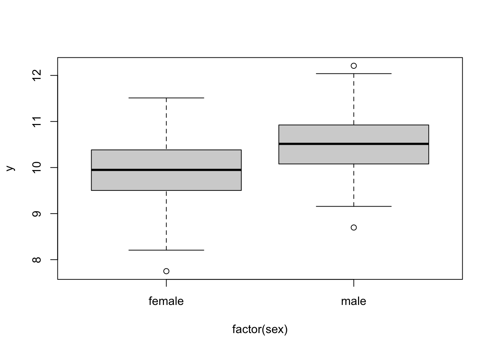
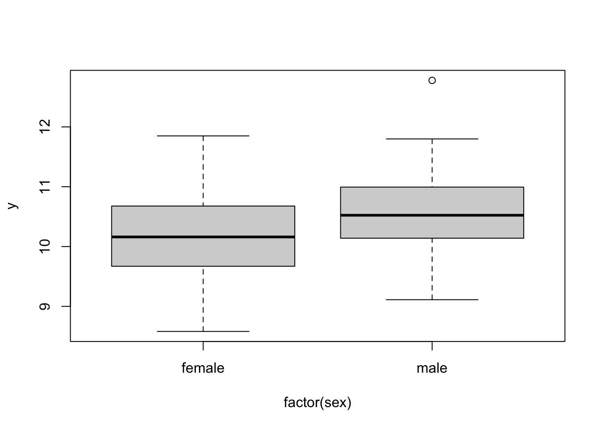
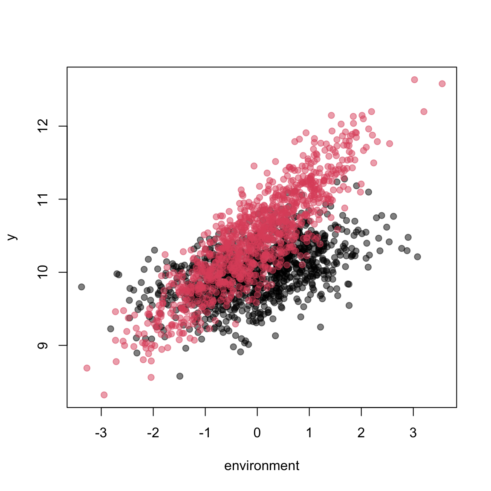

# Hierarchical structure {#hierarchical}

There are two parts to simulating hierarchical data. First you need to have a hierarchical data structure and second you need parameters at each of the different hierarchical levels. The data structure is essentially a data.frame (or matrix), with all the grouping factors and their levels, as we would see in a typical dataset. Lets take the blue tit dataset we explored earlier:


``` r
data(BTdata)
head(BTdata)
```

```
##        tarsus       back  animal     dam fosternest  hatchdate  sex
## 1 -1.89229718  1.1464212 R187142 R187557      F2102 -0.6874021  Fem
## 2  1.13610981 -0.7596521 R187154 R187559      F1902 -0.6874021 Male
## 3  0.98468946  0.1449373 R187341 R187568       A602 -0.4279814 Male
## 4  0.37900806  0.2555847 R046169 R187518      A1302 -1.4656641 Male
## 5 -0.07525299 -0.3006992 R046161 R187528      A2602 -1.4656641  Fem
## 6 -1.13519543  1.5577219 R187409 R187945      C2302  0.3502805  Fem
```
Here `animal`, `dam`, `fosternest` and `sex` make up the data structure.

In this Section, we will first demonstrate how to make a simple hierarchical structure using the `make_structure` function. `simulate_population` also allows pre-existing data structures to be incorporated into simulations. The remaining part of the section details how to simulate hierarchical data once you have a hierarchical data structure. 


## Making a hierarchical structure {#makestr}

We can use the `make_structure` function to create nested and crossed hierarchical data structures. The `make_structure` function only produces balanced data structures, but these can be made unbalanced by sampling, which is outlined in Section \@ref(sampling)


### Single Factor

Simplest structure - one grouping factor with multiple observations. Here we create a structure with 2 repeated observations of 5 individuals (small number are used here simply for illustration purposes). The `structure` contains the name of the grouping factors and their sample sizes, and `repeat_obs` is the number of repeated observations.

``` r
make_structure(structure="individual(5)", repeat_obs=2)
```

```
##    individual
## 1           1
## 2           1
## 3           2
## 4           2
## 5           3
## 6           3
## 7           4
## 8           4
## 9           5
## 10          5
```


### Nested factors
If we want to have nested factors, so different hierarchical groups, where levels of one group only exist in one higher group then we can use the `/` symbol in the `structure` argument. For example, here we have 2 sexes, each with 5 individuals, with 2 repeated measurements each. 

``` r
make_structure(structure="sex(2)/individual(5)", repeat_obs=2)
```

```
##    sex individual
## 1    1          1
## 2    1          1
## 3    1          2
## 4    1          2
## 5    1          3
## 6    1          3
## 7    1          4
## 8    1          4
## 9    1          5
## 10   1          5
## 11   2          6
## 12   2          6
## 13   2          7
## 14   2          7
## 15   2          8
## 16   2          8
## 17   2          9
## 18   2          9
## 19   2         10
## 20   2         10
```
<!-- In this case we have created a nested structure with 2000 observations - 2 observations for each of 1000 individuals, 500 for each of 2 sexes. We can then use this to simulate variation at different levels. Note that sample sizes are extracted from the data structure and so we do not need to specify `N` in the `simulate_population` function as above.
 -->

Note that in the nesting, the sample size for the lower group now represents the number within each level of the higher, rather than the total sample size, so overall there is 10 individuals. 

We can nest as much as we want:

``` r
make_structure(structure="species(2)/population(2)/individual(2)", repeat_obs=2)
```

```
##    species population individual
## 1        1          1          1
## 2        1          1          1
## 3        1          1          2
## 4        1          1          2
## 5        1          2          3
## 6        1          2          3
## 7        1          2          4
## 8        1          2          4
## 9        2          3          5
## 10       2          3          5
## 11       2          3          6
## 12       2          3          6
## 13       2          4          7
## 14       2          4          7
## 15       2          4          8
## 16       2          4          8
```


### Crossed factors
We can create completely crossed factors - every combination of levels exists - using the `+` symbol in the `structure` argument

``` r
make_structure(structure="treatment(2) + individual(5)", repeat_obs=1)
```

```
##    treatment individual
## 1          1          1
## 2          1          2
## 3          1          3
## 4          1          4
## 5          1          5
## 6          2          1
## 7          2          2
## 8          2          3
## 9          2          4
## 10         2          5
```

We can combine crossed and nested structures:

``` r
make_structure(structure="treatment(2) + sex(2)/individual(5)", repeat_obs=1)
```

```
##    treatment sex individual
## 1          1   1          1
## 2          1   1          2
## 3          1   1          3
## 4          1   1          4
## 5          1   1          5
## 6          1   2          6
## 7          1   2          7
## 8          1   2          8
## 9          1   2          9
## 10         1   2         10
## 11         2   1          1
## 12         2   1          2
## 13         2   1          3
## 14         2   1          4
## 15         2   1          5
## 16         2   2          6
## 17         2   2          7
## 18         2   2          8
## 19         2   2          9
## 20         2   2         10
```

We can also output the crossed and nested using `:`

``` r
make_structure(structure="treatment(2) + individual(5) + treatment:individual", repeat_obs=1)
```

```
##    treatment individual treatment_individual
## 1          1          1                    1
## 2          1          2                    2
## 3          1          3                    3
## 4          1          4                    4
## 5          1          5                    5
## 6          2          1                    6
## 7          2          2                    7
## 8          2          3                    8
## 9          2          4                    9
## 10         2          5                   10
```


### Temporal structure

``` r
ds <- make_structure(structure="year(2)/month(12)/day(30)", repeat_obs=1)
head(ds)
```

```
##   year month day
## 1    1     1   1
## 2    1     1   2
## 3    1     1   3
## 4    1     1   4
## 5    1     1   5
## 6    1     1   6
```


``` r
ds <- make_structure(structure="year(2) + month(12) + day(30) + year:month:day", repeat_obs=1)
head(ds)
```

```
##   year month day year_month_day
## 1    1     1   1              1
## 2    1     1   2              2
## 3    1     1   3              3
## 4    1     1   4              4
## 5    1     1   5              5
## 6    1     1   6              6
```

### Naming factor levels
Rather than just outputting 1 - N levels for the level names of each factor, we might want to assign names. 

This can be done for all or some of the grouping factors, using the `level_names` argument. We can input a list, with an item in the list for each grouping factor we want to assign names, and then a vector of their names, which is the same length of the number of levels in that grouping factor. For example, below we just assign names to the two sexes:


``` r
make_structure(structure="sex(2)/individual(5)", repeat_obs=2,  level_names=list(sex=c("female","male")))
```

```
##       sex individual
## 1  female          1
## 2  female          1
## 3  female          2
## 4  female          2
## 5  female          3
## 6  female          3
## 7  female          4
## 8  female          4
## 9  female          5
## 10 female          5
## 11   male          6
## 12   male          6
## 13   male          7
## 14   male          7
## 15   male          8
## 16   male          8
## 17   male          9
## 18   male          9
## 19   male         10
## 20   male         10
```

And then to the individuals and the sexes

``` r
make_structure(structure="sex(2)/individual(5)", repeat_obs=2,  level_names=list(sex=c("female","male"),individual=paste0("ind_",1:10)))
```

```
##       sex individual
## 1  female      ind_1
## 2  female      ind_1
## 3  female      ind_2
## 4  female      ind_2
## 5  female      ind_3
## 6  female      ind_3
## 7  female      ind_4
## 8  female      ind_4
## 9  female      ind_5
## 10 female      ind_5
## 11   male      ind_6
## 12   male      ind_6
## 13   male      ind_7
## 14   male      ind_7
## 15   male      ind_8
## 16   male      ind_8
## 17   male      ind_9
## 18   male      ind_9
## 19   male     ind_10
## 20   male     ind_10
```

<!-- ```{r}
dat_str <- make_structure(structure="species5(2)/population(2)/individual(10)", repeat_obs=3)

plot_nested(dat_str)

structure="species(2)/population5(2)/individual(10)"
structure <- gsub("\\s","",structure)
gsub(".\\)(.)","\\1",structure)
strsplit((gsub("\\w+\\(\\d+\\)","",structure)),"")[[1]]


```
 -->


## Factors
In the first sections, we just simulated continuous predictors, varying at the level of the observation. However, we may want to simulate factors with known or *fixed* effects (i.e. not variables drawn randomly from a particular distribution) at different levels, such as sex or treatment effects.

The first thing we want to do is specify a simple data structure, for example 100 observations for each of two sexes: 


``` r
ds <- make_structure(structure="sex(2)", repeat_obs=100,  level_names=list(sex=c("female","male")))
```

Then we feed this data structure into the `simulate_population()` function using the `data_structure` argument. Note that we no longer need to specify the sample size (`n`), as this is taken from the number of rows in the data_structure.

```r

squid_data <- simulate_population(
  data_structure = ds,
  parameters = ...
)

```

In order to tell the parameter list we have effects that vary at different hierarchical levels, we can create additional slots in the parameter list for the grouping factors, so now it will look something like:

```r

squid_data <- simulate_population(
  data_structure = ds,
  parameters = list(
    intercept = ...,
    sex = list(
      ...
    ),
    observation = list(
      ...
    ),
    residual = list(
      ...
    )
  )
)
```
The names in the parameter list that relate to the different grouping factors either need to match the name in the data structure exactly (as above) or a 'group' argument needs to be given e.g.

```r
squid_data <- simulate_population(
  data_structure = ds,
  parameters = list(
    intercept = ...,
    anything = list(
      group="sex,"
      ...
    ),
    observation = list(
      ...
    ),
    residual = list(
      ...
    )
  )
)
```

We then need to tell the parameters list that we have fixed effects for this grouping factor, in other words we know the difference in body size between the sexes is 0.5, for example. To do this we specify `fixed = TRUE`. 

```r
squid_data <- simulate_population(
  data_structure = ds,
  parameters = list(
    intercept = ...,
    sex = list(
      fixed=TRUE,
      ...
    ),
    observation = list(
      ...
    ),
    residual = list(
      ...
    )
  )
)
```

We can then give a beta for all the different levels of that group. Note that there are two ways to specify this, as there also is in linear models in R. First, we can specify an intercept, and contrasts, equivalent to the output of `lm(body_mass~sex)`, which involves specifying the beta for the first level as 0 to make it the baseline level (or any other level that you would like to be the baseline). Note that, as of version 0.2.4, if the levels for this grouping factor in the data structure have names (in this case "male" and "female"), then the same names have to be specified in the parameter list.


``` r
squid_data <- simulate_population(
  data_structure = ds,
  parameters = list(
    intercept= 10,
    sex=list(
      fixed=TRUE,
      beta=c(0,0.5),
      names = c("female","male")
    ),
    residual = list(
      vcov = 0.5
    )
  )
)

data <- get_population_data(squid_data)

boxplot( y ~ factor(sex), data)
```



``` r
lm( y ~ factor(sex), data)
```

```
## 
## Call:
## lm(formula = y ~ factor(sex), data = data)
## 
## Coefficients:
##     (Intercept)  factor(sex)male  
##          10.176            0.377
```

Alternately, we can specify no intercept (which defaults to 0), and the means for the two levels as betas( equivalent to `lm(body_mass~0+sex)`):

``` r
squid_data <- simulate_population(
  data_structure = ds,
  parameters = list(
    sex=list(
      fixed=TRUE,
      beta=c(10,10.5),
      names = c("female","male")
    ),
    residual = list(
      vcov = 0.5
    )
  )
)

data <- get_population_data(squid_data)

boxplot( y ~ factor(sex), data)
```



``` r
lm( y ~ factor(sex), data)
```

```
## 
## Call:
## lm(formula = y ~ factor(sex), data = data)
## 
## Coefficients:
##     (Intercept)  factor(sex)male  
##          10.132            0.409
```

``` r
lm( y ~ 0+factor(sex), data)
```

```
## 
## Call:
## lm(formula = y ~ 0 + factor(sex), data = data)
## 
## Coefficients:
## factor(sex)female    factor(sex)male  
##             10.13              10.54
```

We would recommend the former methods, as this makes things clearer if other factors are simulated.

<!-- THIS SECTION NEEDS TO BE COMPLETED AS THERE IS A POTENTIAL BUG HERE -->


### Fixed Factor Interactions

We might want to simulate an interaction between a continuous predictor and a factor, for example the effect of the environment varying between two sexes. Specifying this using `simulate_population()` is similar to interactions between two continuous predictors that we have previously encountered (Section \@ref(interactions)). In the `interaction` part of the parameter list, we now specify the contrasts between the slopes for environment, using the names that we have assigned the different levels. In the simulation below, males are larger, and have a larger environment slope:


``` r
squid_data <- simulate_population(
  data_structure = make_structure(structure = "sex(2)", repeat_obs=1000),
  parameters = list(
    intercept=10,
    sex=list(
      fixed=TRUE,
      names=c("female","male"),
      beta=c(0,0.5)
    ),
    observation= list(
      names = c("environment"),
      beta =c(0.2)
      ),
    interactions = list(
      names=c("environment:male"),
      beta = 0.4
      ),
    residual = list(
      names="residual",
      vcov = 0.1
    )
  )
)

data <- get_population_data(squid_data)
head(data)
```

```
##           y female male environment     residual environment:male sex squid_pop
## 1  9.750474      1    0 -1.25796735  0.002067288                0   1         1
## 2 10.456740      1    0 -0.92214063  0.641167781                0   1         1
## 3 10.327966      1    0  0.67783250  0.192399695                0   1         1
## 4  9.976236      1    0  0.71095086 -0.165954375                0   1         1
## 5  9.984801      1    0 -0.08647446  0.002095792                0   1         1
## 6 10.295880      1    0  2.87982801 -0.280085298                0   1         1
```

``` r
plot(y~environment,data, pch=19, col=scales::alpha(c(1,2),0.5)[factor(data$sex)])
```



``` r
lm( y ~ 0 + factor(sex)*environment, data)
```

```
## 
## Call:
## lm(formula = y ~ 0 + factor(sex) * environment, data = data)
## 
## Coefficients:
##             factor(sex)1              factor(sex)2               environment  
##                  10.0031                   10.4872                    0.2023  
## factor(sex)2:environment  
##                   0.3867
```


## Simulating predictors at different hierarchical levels
<!-- <div class="panel panel-success">
<div class="panel-heading">
**Biological example**
</div>
<div class="panel-body">
We have taken repeated measurements of adult body mass.  
</div>
</div> -->
As well as simulating  continuous predictors at the level of the observation, we can also simulate predictors at different hierarchical levels. Let's take the example of a situation where we have repeated measures of individuals. The individuals have traits that are consistently expressed, whilst the environment varies between observations. We can describe variation at these different hierarchical levels as:


$$
y_{ij} = \beta_0 + \boldsymbol{x}_{i} \boldsymbol{\beta}_x + \boldsymbol{u}_j \boldsymbol{\beta}_u + \epsilon_{ij}
$$
$$
\boldsymbol{x}_i \sim \mathcal{N}(\boldsymbol{\mu}_x, \Sigma_x)
$$
$$
\boldsymbol{u}_j \sim \mathcal{N}(\boldsymbol{\mu}_u, \Sigma_u)
$$
$$
\epsilon_i \sim \mathcal{N}(0,\sigma^2_\epsilon)
$$

where $U$ is a matrix of predictors that vary at the individual level (denoted by the subscript $j$), and $X$ is a matrix of predictors at the observation level (denoted by the index $i$).

In order to simulate from this model, we need a data structure and parameters for each of these levels. To do this, we can either specify a data structure generated using `make_structure` (outlined previously in Section \@ref(makestr)), or a pre-existing data structure, to the `simulate_population` function. We then add an item to the parameter list, the name of which matches on of the grouping factors in the data structure, and specify the parameters for predictors that vary at that level in the same way as outlined in the previous section (\@ref(linearmod)). This is similar to the fixed factors above, but we are now assuming that the variable is drawn randomly from a distribution, rather than the effects at each level being fixed. 


Lets imagine that we simulate behaviour, that is a functions of an individual's size and physiology, and also varies in response to the environment, here temperature and rainfall:

``` r
squid_data <- simulate_population(
  data_structure = make_structure(structure = "individual(500)", repeat_obs=2),
  parameters = list(
    individual = list(
      names = c("size","physiology"),
      beta = c(0.1,0.2)
    ),
    observation = list(
      names=c("temperature","rainfall"),
      beta = c(0.2,-0.1)
    ),
    residual = list(
      vcov = 0.5
    )
  ),
  response_names="behaviour"
)

data <- get_population_data(squid_data)

coef(lm(behaviour ~ size + physiology + temperature + rainfall , data))
```

```
## (Intercept)        size  physiology temperature    rainfall 
## -0.03402370  0.07313193  0.17416616  0.24872731 -0.11561841
```

Here, we have simulated 4 predictors, 'size' and 'physiology' that vary at the level of the individual, and 'temperature' and 'rainfall' that vary at the level of the observation. To keep things simple, we will simulate them all as unit normal variables (mean=0 and variance=1). Note, **the names of the different grouping factors in the parameter list (here 'individual') needs to exactly match those in the data structure**. The order does not, however, have to be the same. There are circumstances in which we may want to simulate two sets of effects at the same hierarchical level (for example see permanent environment effects in Section \@ref(va)), in this case we can call them different things in the parameter list, but link them back to the grouping factor, by providing a `group` name. For example the following will produce the same simulation as above:


``` r
squid_data <- simulate_population(
  data_structure = make_structure(structure = "individual(500)", repeat_obs=2),
  parameters = list(
    ind1 = list(
      group="individual",
      names = c("size"),
      beta = c(0.1)
    ),
    ind2 = list(
      group="individual",
      names = c("physiology"),
      beta = c(0.2)
    ),
    observation = list(
      names=c("temperature","rainfall"),
      beta = c(0.2,-0.1)
    ),
    residual = list(
      vcov = 0.5
    )
  ),
  response_names="behaviour"
)
```

It is also worth noting that predictors do not have to be simulated for every grouping factor in the data structure - in this way no variation at that level can be simulated.

### Simulating 'random' effects

In essence, random effects (random intercepts) represent an unobserved/latent predictor (or group of predictors), which varies at a given hierarchical level. In a mixed effect model, the effect at each level of the grouping factor is unknown, and estimated by the model (and assumed to come from a normal distribution). When simulating this, however, we can simply simulate an additional predictor at a particular hierarchical level ($z$) with mean 0 and a given variance ($\sigma^2_z$). 

$$
y_{ij} = \beta_0 + u_j + \epsilon_{ij}
$$
$$
u_j \sim \mathcal{N}(0,\sigma^2_u)
$$
$$
\epsilon_i \sim \mathcal{N}(0,\sigma^2_\epsilon)
$$

For example, we can simulate some among-individual variation as follows:


``` r
squid_data <- simulate_population(
  data_structure = make_structure(structure = "individual(500)", repeat_obs=2),
  parameters = list(
    individual = list(
      vcov = 0.5
    ),
    residual = list(
      vcov = 0.5
    )
  )
)

data <- get_population_data(squid_data)
head(data)
```

```
##              y individual_effect   residual individual squid_pop
## 1  0.602356146         0.1594673  0.4428889          1         1
## 2  1.204485552         0.1594673  1.0450183          1         1
## 3 -0.681867088        -0.3816181 -0.3002490          2         1
## 4 -1.436016418        -0.3816181 -1.0543983          2         1
## 5  0.006081218         0.7306521 -0.7245709          3         1
## 6  0.177797638         0.7306521 -0.5528544          3         1
```

``` r
library(lme4)
short_summary <- function(x) print(summary(x), correlation=FALSE, show.resids=FALSE, ranef.comp = c("Variance"))

short_summary(lmer(y ~ 1 + (1|individual), data))
```

```
## Linear mixed model fit by REML ['lmerMod']
## Formula: y ~ 1 + (1 | individual)
##    Data: data
## 
## REML criterion at convergence: 2694
## 
## Random effects:
##  Groups     Name        Variance
##  individual (Intercept) 0.4741  
##  Residual               0.5103  
## Number of obs: 1000, groups:  individual, 500
## 
## Fixed effects:
##             Estimate Std. Error t value
## (Intercept)  0.03428    0.03819   0.898
```

Note that here we haven't specified any variable names. In this case the simulated predictors are named by the grouping factors (e.g. individual_effect).

### Incorporating existing data structures

We could also use an existing data structure, taking the grouping factors and levels from an existing dataset and input them to `simulate_population`. To demonstrate this, we can use the [blue tit dataset](https://rdrr.io/cran/MCMCglmm/man/BTdata.html) provided with the MCMCglmm package. This is a dataset with some continuous variables (tarsus, back (coloration) and hatchdate), and some grouping factors (animal, dam, fosternest and sex), the latter providing a data structure from which to simulate.


``` r
library(MCMCglmm)
data(BTdata)
head(BTdata)
```

```
##        tarsus       back  animal     dam fosternest  hatchdate  sex
## 1 -1.89229718  1.1464212 R187142 R187557      F2102 -0.6874021  Fem
## 2  1.13610981 -0.7596521 R187154 R187559      F1902 -0.6874021 Male
## 3  0.98468946  0.1449373 R187341 R187568       A602 -0.4279814 Male
## 4  0.37900806  0.2555847 R046169 R187518      A1302 -1.4656641 Male
## 5 -0.07525299 -0.3006992 R046161 R187528      A2602 -1.4656641  Fem
## 6 -1.13519543  1.5577219 R187409 R187945      C2302  0.3502805  Fem
```

``` r
squid_data <- simulate_population(
  data_structure = BTdata[,c("dam","fosternest")],
  parameters = list(
    dam = list(
      vcov = 0.2
    ),
    fosternest = list(
      vcov = 0.3
    ),
    residual = list(
      vcov = 0.5
    )
  )
)

data <- get_population_data(squid_data)
head(data)
```

```
##            y    dam_effect fosternest_effect    residual     dam fosternest
## 1  0.3414224  0.0004465141        0.26993761  0.07103831 R187557      F2102
## 2  0.4892094  0.0512931487       -0.13437510  0.57229137 R187559      F1902
## 3  1.6103895  0.0428057278        0.69045892  0.87712480 R187568       A602
## 4 -1.3354583 -0.2351044549       -0.61425069 -0.48610310 R187518      A1302
## 5 -0.1467267  0.9155448975       -0.44713888 -0.61513276 R187528      A2602
## 6  1.3456794  0.5799862495        0.02555989  0.74013326 R187945      C2302
##   squid_pop
## 1         1
## 2         1
## 3         1
## 4         1
## 5         1
## 6         1
```


<!-- getME(mod,"theta")
library(numDeriv)
fm1Fun <- update(mod,devFunOnly=TRUE)
fm1_thpar <- getME(mod,"theta")
h <- hessian(fm1Fun, fm1_thpar)
sqrt(diag(solve(h)))

mySumm2 <- function(.) {
    c(beta=fixef(.),sigma=sigma(.), sig01=unlist(VarCorr(.)))
}
bootMer(mod,mySumm2,nsim = 100) -->


## Random Regression {#randomslopes}

Random regression (or a random intercepts and slopes model) essentially represents an interaction (or product) between predictors at different levels, with the random slopes being an unobserved, latent variable ($u_2$).

$$
y_{ij} = \beta_0 + \beta_1x_{i} + u_{1j} + u_{2j}x_{i} + \epsilon_{ij}
$$
$$
x_i \sim \mathcal{N}(0,\sigma^2_{x})
$$
$$
\boldsymbol{u}_i \sim \mathcal{N}(0, \Sigma_u)
$$
$$
\epsilon \sim \mathcal{N}(0,\sigma^2_\epsilon)
$$

We can specify random slopes by simulating a slope variable at the individual level (`ind_slope` - $u_{2}$). We can specify the mean environmental effect the slope of the environmental variable ($beta_1$). $u_{2}$ then represents the deviations from the mean slope (this is typically how it is modelled in a linear mixed effect model).
<!-- alternatively the mean environmental effect could be specified as the mean of the slopes variable with the environment slope as 0 -->
Importantly the `beta` parameter associated with `ind_slope` is specified as 0 (there is no 'main effect' of the slopes, just the interaction), and the `beta` parameter associated with interaction is 1.


``` r
squid_data <- simulate_population(
  data_structure=make_structure("individual(300)",repeat_obs=10),
  parameters = list(
    individual = list(
      names = c("ind_int","ind_slope"), 
      beta = c(1,0),
      vcov = c(1,0.5)
    ),
    observation= list(
      names = c("environment"),
      beta = c(0.2)
    ), 
    residual = list(
      vcov = c(0.5)
    ),
    interactions = list(
      names = c("ind_slope:environment"),
      beta = c(1)
    )
  )
)

data <- get_population_data(squid_data)

short_summary(lmer(y ~ environment + (1+environment|individual),data))
```

```
## Linear mixed model fit by REML ['lmerMod']
## Formula: y ~ environment + (1 + environment | individual)
##    Data: data
## 
## REML criterion at convergence: 8075.9
## 
## Random effects:
##  Groups     Name        Variance Cov 
##  individual (Intercept) 0.9964       
##             environment 0.5520   0.04
##  Residual               0.5060       
## Number of obs: 3000, groups:  individual, 300
## 
## Fixed effects:
##             Estimate Std. Error t value
## (Intercept) -0.06715    0.05922  -1.134
## environment  0.24393    0.04546   5.366
```

We can make the link between the code and the equation more explicit, by expanding out the equation:

$$
y_{ij} = \beta_0 + \beta_xx_{i} + \boldsymbol{u}_j \boldsymbol{\beta}_u + \beta_{ux}u_{2j}x_{i} + \epsilon_{ij}
$$

$$
\color{CornflowerBlue}{\boldsymbol{\beta_u} = \begin{bmatrix}
1 \\
0 
\end{bmatrix}}
,
\color{orange}{\beta_{ux}=1}
$$


``` r
squid_data <- simulate_population(
  data_structure=make_structure("individual(300)",repeat_obs=10),
  parameters = list(
    individual = list(
      names = c("ind_int","ind_slope"), 
      beta = c(1,0),
      vcov = c(1,0.5)
    ),
    observation= list(
      names = c("environment"),
      beta = c(0.2)
    ), 
    residual = list(
      vcov = c(0.5)
    ),
    interactions = list(
      names = c("ind_slope:environment"),
      beta = c(1)
    )
  )
)
```


Here we have specified no correlation between intercepts and slopes. To simulate a covariance/correlation between intercepts and slopes, we can simply give the `vcov` argument a covariance matrix, instead of two variances:


``` r
squid_data <- simulate_population(
  data_structure=make_structure("individual(300)",repeat_obs=10),
  parameters = list(
    individual = list(
      names = c("ind_int","ind_slope"), 
      beta = c(1,0),
      vcov = matrix(c(1,0.3,0.3,0.5),ncol=2,nrow=2,byrow=TRUE)
    ),
    observation= list(
      names = c("environment"),
      beta = c(0.2)
    ), 
    residual = list(
      vcov = c(0.5)
    ),
    interactions = list(
      names = c("ind_slope:environment"),
      beta = c(1)
    )
  )
)

data <- get_population_data(squid_data)

short_summary(lmer(y ~ environment + (1+environment|individual),data))
```

```
## Linear mixed model fit by REML ['lmerMod']
## Formula: y ~ environment + (1 + environment | individual)
##    Data: data
## 
## REML criterion at convergence: 8122.5
## 
## Random effects:
##  Groups     Name        Variance Cov 
##  individual (Intercept) 1.1279       
##             environment 0.4933   0.33
##  Residual               0.5244       
## Number of obs: 3000, groups:  individual, 300
## 
## Fixed effects:
##             Estimate Std. Error t value
## (Intercept) 0.009427   0.062869   0.150
## environment 0.266923   0.043233   6.174
```


## Among- and within-group effects {#BetweenWithin}

We may want to simulate the case where a predictor variable varies both within and among groups - in other words it is repeatable at the group level. For example, if we are simulating body mass, we might expect that body mass is a function of an environmental variable, rainfall, and that differs systematically among individuals, as well as within, for example due to spatial variation in where individual lives. 

The simplest way of simulating this is as two rainfall variables, one at the level of the individual and one at the level of the observation, something like:


```r
squid_data <- simulate_population(
  data_structure=make_structure("individual(100)", repeat_obs=5),
  parameters = list(
    individual=list(
      names=c("between_rainfall"), 
      ...
    ),
    observation=list(
      names=c("within_rainfall"), 
      ...
    ),
    residual=list(
      ...
    )
  )
)  
```
We can then specify the variation in rainfall within and between individuals, for example, if the repeatability of rainfall amongst individuals is 0.5, and the total variance in rainfall is 0.8, we would make the variance in rainfall 0.4 at each level:

```r
squid_data <- simulate_population(
  data_structure=make_structure("individual(100)", repeat_obs=5),
  parameters = list(
    individual=list(
      names=c("between_rainfall"), 
      vcov=0.4,
      ...
    ),
    observation=list(
      names=c("within_rainfall"), 
      vcov=0.4,
      ...
    ),
    residual=list(
      0.8
    )
  )
)  
```

If we want the rainfall variable to have a mean that is not 0, we should specify this in only one place, as otherwise they will add up weirdly!
```r
squid_data <- simulate_population(
  data_structure=make_structure("individual(100)", repeat_obs=5),
  parameters = list(
    individual=list(
      names=c("between_rainfall"), 
      vcov=0.4,
      ...
    ),
    observation=list(
      names=c("within_rainfall"), 
      vcov=0.4,
      mean=10
    ),
    residual=list(
      0.8
    )
  )
)  
```
Now we want to add in some betas. If the effect of rainfall on body mass is causal, we would expect the beta to be the same at both levels - this results as a simple reorganisation of the model equation. We start with an effect of rainfall on body size
$$ y_i = \beta_0 + \beta_1 (x_{ij}) + \epsilon_i $$
where $x_{ij}$ is rainfall varying at levels $i$ (observation) and $j$ (individual).

We can split rainfall up into within ($x_{1i}$) and between ($u_{1i}$) individual components:

$$ y_i = \beta_0 + \beta_1 (u_{j} + x_{i}) + \epsilon_i $$

$$ y_i = \beta_0 + \beta_1u_{j} + \beta_{1}x_{i} + \epsilon_i $$

you see that the coefficients should be the same.


``` r
squid_data <- simulate_population(
  data_structure=make_structure("individual(100)", repeat_obs=5),
  parameters = list(
    individual=list(
      names=c("between_env", "ind_int"), 
      vcov=c(0.5,1), 
      beta=c(-2,1)
    ),
    observation=list(
      names=c("within_env"), 
      vcov=c(0.5), 
      beta=c(2)
    ),
    residual=list(
      vcov=1
    )
  )
)  

data <- get_population_data(squid_data)
data$environment <- data$between_env + data$within_env
```


