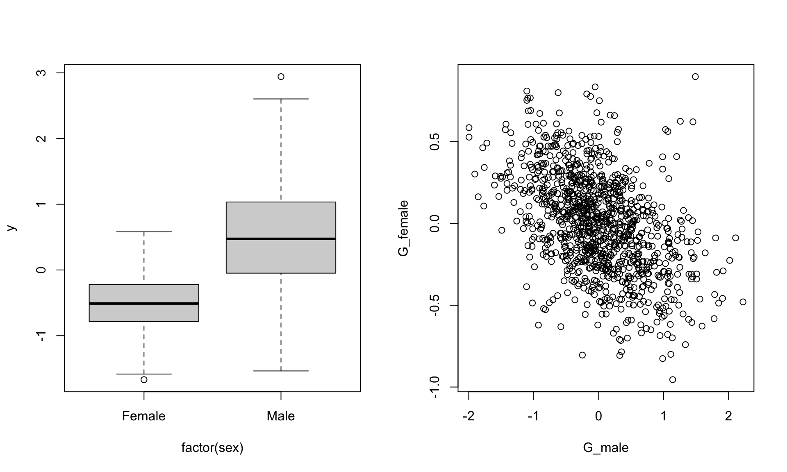

# Genetic effects {#animal}

This vignette assumes that you are generally happy with how the `sim_population()` function works.

## Additive genetics effects {#va}
In order to simulate breeding values (additive genetic effects), we can provide the `simulate_population()` function with the relatedness structure in the population. The simplest way to do this is providing a pedigree using the the `pedigree` argument (a genetic relatedness matrix could also be given to the `cov_str` argument). The input to this argument needs to be a list, and the name of the pedigree in the list links it with the item in the parameter list.

**NOTE** the `simulate_population` function has very little error checking of pedigree structure at the moment 

When simulating breeding values, **all** individuals in pedigree need to be in the data_structure and *vice versa*. Having unsampled individuals (for example the base population) can be achieved in the sampling stage (not implemented yet). 

Lets start by importing a pedigree

```r
library(MCMCglmm)
data(BTped)
head(BTped)
```

```
##    animal  dam sire
## 1 R187557 <NA> <NA>
## 2 R187559 <NA> <NA>
## 3 R187568 <NA> <NA>
## 4 R187518 <NA> <NA>
## 5 R187528 <NA> <NA>
## 6 R187945 <NA> <NA>
```

We can use this pedigree as a data_structure

```r
squid_data <- simulate_population(
  data_structure = BTped, 
 
  pedigree = list(animal=BTped),
  
  parameters =list(
    animal = list(
      vcov = 0.2
    ),
    residual = list(
      vcov = 0.5
    )
  )
)

data <- get_population_data(squid_data)
head(data)
```

```
##                  y animal_effect   residual  animal  dam sire squid_pop
## R187557 -0.7104031    -0.1749195 -0.5354836 R187557 <NA> <NA>         1
## R187559  1.2892857     0.6665992  0.6226864 R187559 <NA> <NA>         1
## R187568  1.6393384     0.6900526  0.9492857 R187568 <NA> <NA>         1
## R187518  1.2545103     0.3999815  0.8545287 R187518 <NA> <NA>         1
## R187528 -0.4945722    -0.3827869 -0.1117853 R187528 <NA> <NA>         1
## R187945  0.1780773    -0.3703026  0.5483799 R187945 <NA> <NA>         1
```

```r
# Ainv<-inverseA(BTped)$Ainv
# mod <- MCMCglmm(y~1, random=~ animal,data=data,ginverse=list(animal=Ainv),verbose=FALSE)
# summary(mod)
```


We might want to simulate repeated measurements to allow estimation of permanent environment effects. This is where being able to have something in the parameter list with a different name to the grouping factor is useful. In this way permanent environmental and additive genetic effects can be simulated in different parts of the parameter list, and linked to the same part of the data_structure.


```r
## make data structure with two observations per individual
ds <- data.frame(individual=rep(BTped[,1], 2))

squid_data <- simulate_population(
  data_structure = ds, 
  pedigree=list(animal=BTped),
  parameters = list(
    individual = list(
      vcov = 0.3
    ),
    animal = list(
      group="individual",
      vcov = 0.2
    ),
    residual = list(
      vcov = 0.5
    )
  )
)

data <- get_population_data(squid_data)
head(data)
```

```
##                   y individual_effect animal_effect   residual individual
## R187888 -0.29800108        -0.3030617    -0.2605827  0.2656433    R187557
## R187646  0.17464214         0.3344371    -0.5309132  0.3711182    R187559
## R187330  1.17443051         0.7872808     0.9885985 -0.6014488    R187568
## R187374 -0.88713844        -0.4727921    -0.1421482 -0.2721982    R187518
## R187225 -0.06469935        -0.2399442     0.5130975 -0.3378527    R187528
## R187133  1.72913172         0.5764696     0.7417825  0.4108797    R187945
##         squid_pop
## R187888         1
## R187646         1
## R187330         1
## R187374         1
## R187225         1
## R187133         1
```

```r
# Ainv<-inverseA(BTped)$Ainv
# data$animal_id <- data$individual
# mod <- MCMCglmm(y~1, random=~ individual + animal_id,data=data,ginverse=list(animal_id=Ainv),verbose=FALSE)
# summary(mod)
```

## Multivariate genetic effects

We can simulate genetic effects affecting multiple phenotypes and the covariance between them, by specifying the number of response variables, and a covariance matrix, instead of only a variance.

```r
squid_data <- simulate_population(
  data_structure = BTped,
  pedigree = list(animal = BTped),
  n_response=2,
  parameters = list(
    animal = list(
      vcov = diag(2)

    ),
    residual = list(
      vcov = diag(2)
    )
  )
)

data <- get_population_data(squid_data)
head(data)
```

```
##                 y1         y2 animal_effect1 animal_effect2  residual1
## R187557 -0.8385548  0.1841058      0.6786441     -0.3935136 -1.5171990
## R187559 -0.4701207  1.0400757     -1.4113157      1.0666325  0.9411949
## R187568 -0.1846425  0.3584195      1.0712568      0.3008260 -1.2558993
## R187518 -0.9746306  1.1945939     -2.3299460      0.7226137  1.3553154
## R187528 -0.8318896  0.2290793      0.3754430      0.3256557 -1.2073326
## R187945  1.8103155 -1.2127095      2.1203028     -1.2159118 -0.3099873
##            residual2  animal  dam sire squid_pop
## R187557  0.577619380 R187557 <NA> <NA>         1
## R187559 -0.026556865 R187559 <NA> <NA>         1
## R187568  0.057593543 R187568 <NA> <NA>         1
## R187518  0.471980260 R187518 <NA> <NA>         1
## R187528 -0.096576413 R187528 <NA> <NA>         1
## R187945  0.003202301 R187945 <NA> <NA>         1
```

```r
# Ainv<-inverseA(BTped)$Ainv
# mod <- MCMCglmm(cbind(y1,y2)~1,random=~us(trait):animal, rcov=~us(trait):units,data=data,family=rep("gaussian",2),verbose=FALSE,ginverse=list(animal=Ainv))
# summary(mod)
```

<br>


## Sex specific genetic variance and inter-sexual genetic correlations


```r
ds <- data.frame(animal=BTped[,"animal"],sex=sample(c("Female","Male"),nrow(BTped), replace=TRUE))

squid_data <- simulate_population(
  parameters = list(
    sex=list(
      fixed=TRUE,
      names=c("Female","Male"),
      beta=c(-0.5,0.5)
    ),
    animal= list(
      names = c("G_female","G_male"),
      vcov =matrix(c(0.1,-0.1,-0.1,0.4), nrow=2, ncol=2 ,byrow=TRUE)
      ),
    residual = list(
      names="residual",
      vcov = 0.1
    )
  ),
  data_structure = ds,
  pedigree = list(animal=BTped),
  model = "y = Female + Male + I(Female)*G_female + I(Male)*G_male + residual"
)

data <- get_population_data(squid_data)
head(data)
```

```
##            y Female Male    G_female      G_male    residual  animal    sex
## 1  0.2055466      0    1  0.47080769 -0.73545126  0.44099788 R187557   Male
## 2  0.4324628      0    1 -0.62078654 -0.01386573 -0.05367147 R187559   Male
## 3 -0.5981933      1    0 -0.14154068  0.15570322  0.04334741 R187568 Female
## 4 -0.8820294      1    0 -0.09385028 -0.33749998 -0.28817915 R187518 Female
## 5 -0.5110713      0    1  0.31509524 -0.70944997 -0.30162129 R187528   Male
## 6 -0.1480012      1    0  0.07452335  0.34664838  0.27747548 R187945 Female
##   squid_pop
## 1         1
## 2         1
## 3         1
## 4         1
## 5         1
## 6         1
```

```r
par(mfrow=c(1,2))
boxplot(y~factor(sex),data)
plot(G_female~G_male,data)
```


<br>

## Indirect Genetic Effects {#IGE}
Indirect genetic effects are a bit more difficult to code. Lets take the example of maternal genetic effects. The maternal genetic effect that affects an individual's phenotype, is that of its mother, not itself. Here we can use `[]` to index the levels of the random effects within the formula. We need to be careful here as internally in `simulate_population()` the indexing of the factors in the data structure is done independently. We therefore need to generate a index for the mothers that links to the individual. We can do this using the `index_link` argument - in the code below we create a new factor to index with, called `dam_link`, that is the dam factor in our data structure, that has been indexed to match the animal factor.

Using this indexing trick, we can simulate the direct genetic and maternal genetic effects that an individual has (and the covariance between them), as well as generating an individual's phenotype from its own direct genetic effects, and its mother's maternal genetic effect.


```r
squid_data <- simulate_population(
  parameters=list(
    animal = list(
      names=c("direct","maternal"),
      vcov = matrix(c(1,0.3,0.3,0.5),2,2)
    ),
    residual = list(
      names="residual",
      vcov = 0.5
    )
  ),
  data_structure=BTped,
  pedigree=list(animal=BTped),
  index_link=list(dam_link="dam-animal"),
  model = "y = direct + maternal[dam_link] + residual"
)
```

```
## Warning in FUN(X[[i]], ...): Not all levels are of dam are present in animal
## meaning that there will be NAs in the new grouping factor
```

```r
data <- get_population_data(squid_data)

head(data)
```

```
##    y     direct    maternal    residual  animal  dam sire squid_pop
## 1 NA -1.1765364 -0.33246522  0.98593948 R187557 <NA> <NA>         1
## 2 NA  1.0032654  0.17594714  0.46289797 R187559 <NA> <NA>         1
## 3 NA -1.3823286 -0.43613248 -0.89167875 R187568 <NA> <NA>         1
## 4 NA  0.3973638 -0.07201462  0.16249743 R187518 <NA> <NA>         1
## 5 NA -1.2407912 -0.56117955 -0.01929683 R187528 <NA> <NA>         1
## 6 NA  0.6117901  0.45613335  1.49005498 R187945 <NA> <NA>         1
```


## GxE
Coming soon...

<!-- 
  I dont know why this doesnt work

  
squid_data <- simulate_population(
  parameters = list(
    animal = list(
      names = c("G_int","G_slope"),
      mean = c(0,0), 
      vcov = matrix(c(1,0.3,0.3,0.5),ncol=2,nrow=2,byrow=TRUE),
      beta = c(1,0)
    ),
    observation= list(
      names = c("environment"),
      vcov = c(0.2)
    ), 
    residual = list(
      names = c("residual"),
      vcov = c(0.5)
    ),
    interactions=list(
      names = "G_slope:environment",
      beta = 1
    )
  ),
  data_structure=rbind(BTped,BTped,BTped,BTped,BTped),
  pedigree = list(animal=BTped)
)

data <- get_population_data(squid_data)
library(lme4)
short_summary <- function(x) print(summary(x), correlation=FALSE, show.resids=FALSE, ranef.comp = c("Variance"))

short_summary(lmer(y ~ environment + (1+environment|animal),data))

 -->


## Dominance
Coming soon...
<!--
Here we can make use of the dominance relatedness matrices that can be generated in the `nadiv` package

NOTE: not working fully yet!!! 
 
 -->

## Inbreeding depression
Coming soon...


## Genetic Groups
Coming soon...

