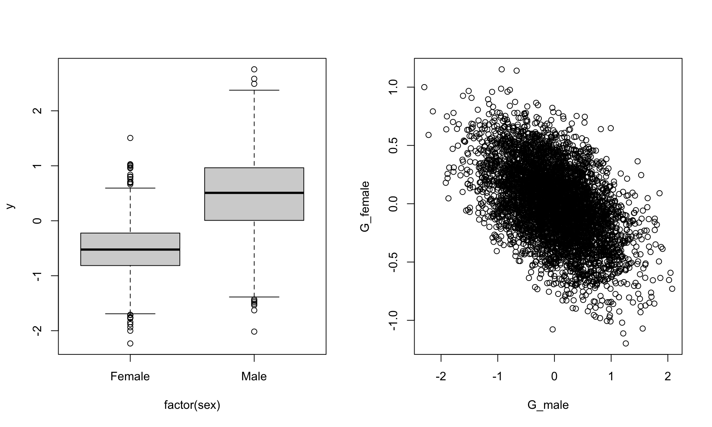

# Genetic effects {#animal}

This vignette assumes that you are generally happy with how the `sim_population()` function works.

## Additive genetics effects {#va}
In order to simulate breeding values (additive genetic effects), we can provide the `simulate_population()` function with the relatedness structure in the population. The simplest way to do this is providing a pedigree using the the `pedigree` argument (a genetic relatedness matrix could also be given to the `cov_str` argument). The input to this argument needs to be a list, and the name of the pedigree in the list links it with the item in the parameter list.

**NOTE** the `simulate_population` function has very little error checking of pedigree structure at the moment 

When simulating breeding values, **all** individuals in pedigree need to be in the data_structure and *vice versa*. Having unsampled individuals (for example the base population) can be achieved in the sampling stage (not implemented yet). 

Lets start by importing a pedigree from the pedtricks package

``` r
library(squidSim)
library(nadiv)
library(gremlin)
library(pedtricks)

data(gryphons)

ped <- fix_ped(gryphons[,1:3])
head(ped)
```

```
##    id  dam sire
## 1 204 <NA> <NA>
## 2 205 <NA> <NA>
## 3 206 <NA> <NA>
## 4 207 <NA> <NA>
## 5 208 <NA> <NA>
## 6 209 <NA> <NA>
```

``` r
names(ped)[1]<-"animal"
```

We can use this pedigree as a data_structure

``` r
squid_data <- simulate_population(
  data_structure = ped[,1:3], 
 
  pedigree = list(animal=ped[,1:3]),
  
  parameters =list(
    animal = list(
      vcov = 0.2
    ),
    residual = list(
      vcov = 0.5
    )
  )
)

data <- get_population_data(squid_data)
head(data)
```

```
##            y animal_effect   residual animal  dam sire squid_pop
## 1 -2.3553680    -0.2981992 -2.0571688    204 <NA> <NA>         1
## 2 -0.0831304     0.2218079 -0.3049383    205 <NA> <NA>         1
## 3 -0.1690798    -0.2820988  0.1130190    206 <NA> <NA>         1
## 4  1.6868459     0.6530291  1.0338168    207 <NA> <NA>         1
## 5 -0.4311466    -0.5338738  0.1027271    208 <NA> <NA>         1
## 6 -0.1819541    -0.4747195  0.2927654    209 <NA> <NA>         1
```

We can use the grelim pacakge to run a REML animal model

``` r
Ainv <- makeAinv(ped)$Ainv

mod <- gremlin(y~1, random=~ animal,data=data,ginverse=list(animal=Ainv))
```

```
## gremlin started:		 18:14:56
```

```
## 'as(<dsyMatrix>, "dsCMatrix")' is deprecated.
## Use 'as(., "CsparseMatrix")' instead.
## See help("Deprecated") and help("Matrix-deprecated").
```

```
##   1 of max 20		lL:-7685.481081		took 0.0037 sec.
##   2 of max 20		lL:-1671.313492		took 0.0026 sec.
##   3 of max 20		lL:-1604.018169		took 0.0026 sec.
##   4 of max 20		lL:-1601.696981		took 0.0026 sec.
##   5 of max 20		lL:-1601.692845		took 0.0026 sec.
##   6 of max 20		lL:-1601.692845		took 0.0026 sec.
##   7 of max 20		lL:-1601.692845		took 0.0026 sec.
## 
## ***  REML converged  ***
## 
## gremlin ended:		 18:14:56
```

``` r
summary(mod)
```

```
## 
##  Linear mixed model fit by REML [' gremlin ']
##  REML log-likelihood: -1601.693 
## 	 lambda: FALSE 
## 
##  elapsed time for model: 0.0564 
## 
##  Scaled residuals:
##      Min       1Q   Median       3Q      Max 
## -3.05039 -0.54998  0.00371  0.54487  3.14710 
## 
##  (co)variance parameters: ~animal 
## 		    rcov: ~units 
##          Estimate Std. Error
## G.animal   0.2854    0.02908
## ResVar1    0.4477    0.02554
## 
##  (co)variance parameter sampling correlations:
##          G.animal ResVar1
## G.animal   1.0000 -0.8469
## ResVar1   -0.8469  1.0000
## 
##  Fixed effects: y ~ 1 
##             Estimate Std. Error z value
## (Intercept) -0.02358    0.01526  -1.545
```


We don't have to simulate a phenotype for everyone in the pedigree, so can include a subset of IDs in the data strcuture

``` r
ds <- data.frame(animal =ped[sample(1:nrow(ped),1000,replace=FALSE),1])

squid_data <- simulate_population(
  data_structure = ds, 
 
  pedigree = list(animal=ped[,1:3]),
  
  parameters =list(
    animal = list(
      vcov = 0.2
    ),
    residual = list(
      vcov = 0.5
    )
  )
)

data <- get_population_data(squid_data)
head(data)
```

```
##             y animal_effect    residual animal squid_pop
## 1 -0.46968357   -0.17338301 -0.29630056   3380         1
## 2 -0.08352477   -0.17213302  0.08860825    362         1
## 3 -1.48977040   -0.85945395 -0.63031645   1918         1
## 4 -0.20485162   -0.50879642  0.30394481   2708         1
## 5  0.39879740   -0.08200417  0.48080157   4287         1
## 6 -0.59120933   -0.19983313 -0.39137620   3418         1
```


``` r
Ainv <- makeAinv(ped)$Ainv

mod <- gremlin(y~1, random=~ animal,data=data,ginverse=list(animal=Ainv))
```

```
## gremlin started:		 11:24:44
```

```
## 'as(<dsyMatrix>, "dsCMatrix")' is deprecated.
## Use 'as(., "CsparseMatrix")' instead.
## See help("Deprecated") and help("Matrix-deprecated").
```

```
##   1 of max 20		lL:-1551.356413		took 0.0034 sec.
##   2 of max 20		lL:-418.535368		took 0.0023 sec.
##   3 of max 20		lL:-365.175306		took 0.0022 sec.
##   4 of max 20		lL:-359.174824		took 0.0022 sec.
##   5 of max 20		lL:-359.005605		took 0.0022 sec.
##   6 of max 20		lL:-359.005415		took 0.0022 sec.
##   7 of max 20		lL:-359.005415		took 0.0022 sec.
## 
## ***  REML converged  ***
## 
## gremlin ended:		 11:24:44
```

``` r
summary(mod)
```

```
## 
##  Linear mixed model fit by REML [' gremlin ']
##  REML log-likelihood: -359.0054 
## 	 lambda: FALSE 
## 
##  elapsed time for model: 0.0457 
## 
##  Scaled residuals:
##      Min       1Q   Median       3Q      Max 
## -2.43366 -0.45542  0.02354  0.43253  2.86515 
## 
##  (co)variance parameters: ~animal 
## 		    rcov: ~units 
##          Estimate Std. Error
## G.animal   0.4207    0.09582
## ResVar1    0.3480    0.08755
## 
##  (co)variance parameter sampling correlations:
##          G.animal ResVar1
## G.animal   1.0000 -0.9299
## ResVar1   -0.9299  1.0000
## 
##  Fixed effects: y ~ 1 
##             Estimate Std. Error z value
## (Intercept) -0.04197    0.03176  -1.321
```


We might want to simulate repeated measurements to allow estimation of permanent environment effects. The simplest way to do this is to create a duplicated column in the data structure of the individual IDs. Permanent environment effects that are not linked to the pedigree can then be simulated.

<!-- 
We might want to simulate repeated measurements to allow estimation of permanent environment effects. This is where being able to have something in the parameter list with a different name to the grouping factor is useful. In this way permanent environmental and additive genetic effects can be simulated in different parts of the parameter list, and linked to the same part of the data_structure.
 -->

:::: {.blackbox data-latex=""}
::: {.center data-latex=""}
**NOTICE!**
:::
The instructions given for simulating permanent environment effects using squidSim were incorrect in the vignette prior to version 0.2.0 (updated in September 2025). 
::::


``` r
## make data structure with two observations per individual, with ID duplicated in two columns, animal and individual, and link the animal column in the data structure to the pedigree
ds <- data.frame(animal=rep(ped[,1], 2),individual=rep(ped[,1], 2))

squid_data <- simulate_population(
  data_structure = ds, 
  pedigree=list(animal=ped),
  parameters = list(
    animal = list(
      vcov = 0.2
    ),
    individual = list(
      vcov = 0.3
    ),
    residual = list(
      vcov = 0.5
    )
  )
)

data <- get_population_data(squid_data)
head(data)
```

```
##            y animal_effect individual_effect   residual animal individual
## 1 -0.7812849     0.4665620        -1.0389875 -0.2088594    204        204
## 2 -0.3499417    -0.9695562         0.2860528  0.3335617    205        205
## 3 -0.7490084    -0.5394729         0.2739732 -0.4835087    206        206
## 4 -1.1704516    -0.2701808         0.1314451 -1.0317159    207        207
## 5  0.2931743     0.1025247        -0.6129429  0.8035925    208        208
## 6 -0.1245506     0.7061392        -0.1828131 -0.6478767    209        209
##   squid_pop
## 1         1
## 2         1
## 3         1
## 4         1
## 5         1
## 6         1
```


``` r
Ainv <- makeAinv(ped)$Ainv

mod_pe <- gremlin(y~1, random=~ animal + individual,data=data,ginverse=list(animal=Ainv))
```

```
## gremlin started:		 11:24:44 
##   1 of max 20		lL:-12123.358564		took 0.0051 sec.
##   2 of max 20		lL:-4380.793795		took 0.0043 sec.
##   3 of max 20		lL:-4212.077157		took 0.0042 sec.
##   4 of max 20		lL:-4204.524508		took 0.0042 sec.
##   5 of max 20		lL:-4204.496825		took 0.0042 sec.
##   6 of max 20		lL:-4204.496825		took 0.0042 sec.
##   7 of max 20		lL:-4204.496825		took 0.0041 sec.
## 
## ***  REML converged  ***
## 
## gremlin ended:		 11:24:44
```

``` r
summary(mod_pe)
```

```
## 
##  Linear mixed model fit by REML [' gremlin ']
##  REML log-likelihood: -4204.497 
## 	 lambda: FALSE 
## 
##  elapsed time for model: 0.0596 
## 
##  Scaled residuals:
##     Min      1Q  Median      3Q     Max 
## -3.8558 -0.5524 -0.0036  0.5431  3.0406 
## 
##  (co)variance parameters: ~animal + individual 
## 		    rcov: ~units 
##              Estimate Std. Error
## G.animal       0.2237   0.029221
## G.individual   0.3022   0.027781
## ResVar1        0.4947   0.009977
## 
##  (co)variance parameter sampling correlations:
##                G.animal G.individual    ResVar1
## G.animal      1.000e+00      -0.8268 -1.794e-15
## G.individual -8.268e-01       1.0000 -1.796e-01
## ResVar1      -1.977e-15      -0.1796  1.000e+00
## 
##  Fixed effects: y ~ 1 
##             Estimate Std. Error z value
## (Intercept) 0.002897    0.01537  0.1885
```


## Multivariate genetic effects

We can simulate genetic effects affecting multiple phenotypes and the covariance between them, by specifying the number of response variables, and a covariance matrix, instead of only a variance.

``` r
squid_data <- simulate_population(
  data_structure = ped,
  pedigree = list(animal = ped),
  n_response=2,
  parameters = list(
    animal = list(
      vcov = diag(2)

    ),
    residual = list(
      vcov = diag(2)
    )
  )
)

data <- get_population_data(squid_data)
head(data)
```

```
##           y1          y2 animal_effect1 animal_effect2  residual1  residual2
## 1  0.6642658  0.83471076     0.46407220     0.22094082  0.2001936  0.6137699
## 2 -0.7466087  0.14747280     0.54421651     0.52761540 -1.2908253 -0.3801426
## 3  1.6963890 -0.40456141     0.39385325    -0.30347849  1.3025357 -0.1010829
## 4  1.9764612  0.85993234     0.08271504     0.26908060  1.8937461  0.5908517
## 5 -0.8080648 -0.09793586    -1.85489445     0.07503407  1.0468296 -0.1729699
## 6  3.0311582  0.96837367     2.32009932     0.25440902  0.7110589  0.7139646
##   animal  dam sire squid_pop
## 1    204 <NA> <NA>         1
## 2    205 <NA> <NA>         1
## 3    206 <NA> <NA>         1
## 4    207 <NA> <NA>         1
## 5    208 <NA> <NA>         1
## 6    209 <NA> <NA>         1
```


``` r
library(MCMCglmm)
Ainv<-inverseA(ped)$Ainv
mod <- MCMCglmm(cbind(y1,y2)~1,
  random=~us(trait):animal, 
  rcov=~us(trait):units,
  data=data,
  ginverse=list(animal=Ainv),
  family=rep("gaussian",2),
  verbose=FALSE)
summary(mod)
```

```
## 
##  Iterations = 3001:12991
##  Thinning interval  = 10
##  Sample size  = 1000 
## 
##  DIC: 32469.06 
## 
##  G-structure:  ~us(trait):animal
## 
##                        post.mean l-95% CI u-95% CI eff.samp
## traity1:traity1.animal   0.99346  0.82773   1.1631    162.4
## traity2:traity1.animal   0.01649 -0.09408   0.1259    211.7
## traity1:traity2.animal   0.01649 -0.09408   0.1259    211.7
## traity2:traity2.animal   1.06973  0.87654   1.2265    202.6
## 
##  R-structure:  ~us(trait):units
## 
##                       post.mean l-95% CI u-95% CI eff.samp
## traity1:traity1.units   1.06566   0.9433  1.21635    206.0
## traity2:traity1.units  -0.05158  -0.1421  0.04004    209.5
## traity1:traity2.units  -0.05158  -0.1421  0.04004    209.5
## traity2:traity2.units   0.97807   0.8336  1.10499    211.3
## 
##  Location effects: cbind(y1, y2) ~ 1 
## 
##             post.mean l-95% CI u-95% CI eff.samp pMCMC
## (Intercept)  -0.02171 -0.05669  0.01237    893.3 0.242
```

<br>


## Sex specific genetic variance and inter-sexual genetic correlations


``` r
ds <- data.frame(animal=gryphons[,"id"],sex=sample(c("Female","Male"),nrow(gryphons), replace=TRUE))

squid_data <- simulate_population(
  parameters = list(
    sex=list(
      fixed=TRUE,
      names=c("Female","Male"),
      beta=c(-0.5,0.5)
    ),
    animal= list(
      names = c("G_female","G_male"),
      vcov =matrix(c(0.1,-0.1,-0.1,0.4), nrow=2, ncol=2 ,byrow=TRUE)
      ),
    residual = list(
      names="residual",
      vcov = 0.1
    )
  ),
  data_structure = ds,
  pedigree = list(animal=ped),
  model = "y = Female + Male + I(Female)*G_female + I(Male)*G_male + residual"
)

data <- get_population_data(squid_data)
head(data)
```

```
##            y Female Male    G_female     G_male    residual animal    sex
## 1 -1.1406269      1    0 -0.41650798  0.8611695 -0.22411895    204 Female
## 2 -0.9338681      1    0  0.02895999  0.7161771 -0.46282805    205 Female
## 3 -0.5726704      1    0 -0.11908647  0.3606215  0.04641609    206 Female
## 4  0.5511020      0    1 -0.45076138  0.2253053 -0.17420333    207   Male
## 5 -0.6838055      1    0 -0.12133713 -0.3310633 -0.06246839    208 Female
## 6 -0.1827386      0    1  0.33321284 -0.6581778 -0.02456084    209   Male
##   squid_pop
## 1         1
## 2         1
## 3         1
## 4         1
## 5         1
## 6         1
```

``` r
par(mfrow=c(1,2))
boxplot(y~factor(sex),data)
plot(G_female~G_male,data)
```


<br>

## Indirect Genetic Effects {#IGE}
Indirect genetic effects are a bit more difficult to code. Lets take the example of maternal genetic effects. The maternal genetic effect that affects an individual's phenotype, is that of its mother, not itself. Here we can use `[]` to index the levels of the random effects within the formula. We need to be careful here as internally in `simulate_population()` the indexing of the factors in the data structure is done independently. We therefore need to generate a index for the mothers that links to the individual. We can do this using the `index_link` argument - in the code below we create a new factor to index with, called `dam_link`, that is the dam factor in our data structure, that has been indexed to match the animal factor.

Using this indexing trick, we can simulate the direct genetic and maternal genetic effects that an individual has (and the covariance between them), as well as generating an individual's phenotype from its own direct genetic effects, and its mother's maternal genetic effect.


``` r
squid_data <- simulate_population(
  parameters=list(
    animal = list(
      names=c("direct","maternal"),
      vcov = matrix(c(1,0.3,0.3,0.5),2,2)
    ),
    residual = list(
      names="residual",
      vcov = 0.5
    )
  ),
  data_structure=ped,
  pedigree=list(animal=ped),
  index_link=list(dam_link="dam-animal"),
  model = "y = direct + maternal[dam_link] + residual"
)
```

```
## Warning: Not all levels are of dam are present in animal meaning that there
## will be NAs in the new grouping factor
```

``` r
data <- get_population_data(squid_data)

head(data)
```

```
##    y     direct     maternal    residual animal  dam sire squid_pop
## 1 NA -1.3868139 -0.958645316 -0.53517980    204 <NA> <NA>         1
## 2 NA -0.3557084 -0.020020959 -0.05060699    205 <NA> <NA>         1
## 3 NA -1.6063940 -0.008095092  0.44336246    206 <NA> <NA>         1
## 4 NA -0.5702206  1.481172744 -0.31267001    207 <NA> <NA>         1
## 5 NA -0.6878199  1.331302491 -0.68215405    208 <NA> <NA>         1
## 6 NA -0.4438793  0.168884393 -0.70437684    209 <NA> <NA>         1
```


## GxE


``` r
squid_data <- simulate_population(
  parameters = list(
    animal = list(
      names = c("G_int","G_slope"),
      mean = c(0,0), 
      vcov = matrix(c(1,0.3,0.3,0.5),ncol=2,nrow=2,byrow=TRUE),
      beta = c(1,0)
    ),
    observation= list(
      names = c("environment"),
      vcov = c(0.2)
    ), 
    residual = list(
      names = c("residual"),
      vcov = c(0.5)
    ),
    interactions=list(
      names = "G_slope:environment",
      beta = 1
    )
  ),
  data_structure=rbind(ped,ped,ped,ped,ped),
  pedigree = list(animal=ped)
)

data <- get_population_data(squid_data)
library(lme4)
short_summary <- function(x) print(summary(x), correlation=FALSE, show.resids=FALSE, ranef.comp = c("Variance"))

short_summary(lmer(y ~ environment + (1+environment|animal),data))
```

```
## Linear mixed model fit by REML ['lmerMod']
## Formula: y ~ environment + (1 + environment | animal)
##    Data: data
## 
## REML criterion at convergence: 66750.8
## 
## Random effects:
##  Groups   Name        Variance Cov 
##  animal   (Intercept) 0.9920       
##           environment 0.5068   0.30
##  Residual             0.4955       
## Number of obs: 24590, groups:  animal, 4918
## 
## Fixed effects:
##             Estimate Std. Error t value
## (Intercept)  0.02510    0.01497   1.677
## environment  0.98595    0.01580  62.386
```


## Dominance
Here we can make use of the dominance relatedness matrices that can be generated in the `nadiv` package


``` r
data(warcolak)

pedD <- warcolak[,1:3]

Dmats <- makeD(pedD)
```

```
## starting to make D....done 
## starting to invert D....done
```

``` r
Dmat <- Dmats$D
```

We can input this into `simulate_population()` with the `cov_str` argument:

``` r
ds <- data.frame(animal = pedD[,1], animalD = pedD[,1])

squid_data <- simulate_population(
  data_structure = ds, 
 
  pedigree = list(animal=pedD[,1:3]),
  cov_str = list(animalD=Dmat),

  parameters =list(
    animal = list(
      vcov = 0.2
    ),
    animalD = list(
      vcov = 0.2
    ),
    residual = list(
      vcov = 0.5
    )
  )
)

data <- get_population_data(squid_data)
```

We can then run a model to check the simulation, using {gremlin}, with inverse A and D matrices:

``` r
Dinv <- Dmats$Dinv
Ainv_dom <- makeAinv(pedD)$Ainv

mod_dom <- gremlin(y~1, random=~ animal + animalD,data=data,ginverse=list(animal=Ainv_dom,animalD=Dinv))
```

```
## gremlin started:		 11:24:45 
##   1 of max 20		lL:-5762.227161		took 0.0061 sec.
##   2 of max 20		lL:-2494.762867		took 0.0049 sec.
##   3 of max 20		lL:-2312.124280		took 0.0049 sec.
##   4 of max 20		lL:-2299.455179		took 0.0048 sec.
##   5 of max 20		lL:-2299.355390		took 0.0048 sec.
##   6 of max 20		lL:-2299.355382		took 0.0048 sec.
##   7 of max 20		lL:-2299.355382		took 0.0048 sec.
## 
## ***  REML converged  ***
## 
## gremlin ended:		 11:24:45
```

``` r
summary(mod_dom)
```

```
## 
##  Linear mixed model fit by REML [' gremlin ']
##  REML log-likelihood: -2299.355 
## 	 lambda: FALSE 
## 
##  elapsed time for model: 0.0863 
## 
##  Scaled residuals:
##      Min       1Q   Median       3Q      Max 
## -2.92188 -0.54659  0.02061  0.55849  3.09950 
## 
##  (co)variance parameters: ~animal + animalD 
## 		    rcov: ~units 
##           Estimate Std. Error
## G.animal    0.2068    0.02422
## G.animalD   0.1588    0.04980
## ResVar1     0.5437    0.04572
## 
##  (co)variance parameter sampling correlations:
##           G.animal G.animalD  ResVar1
## G.animal   1.00000   -0.2807 -0.01946
## G.animalD -0.28069    1.0000 -0.89553
## ResVar1   -0.01946   -0.8955  1.00000
## 
##  Fixed effects: y ~ 1 
##             Estimate Std. Error z value
## (Intercept) -0.02196    0.02418 -0.9084
```


## Inbreeding depression
Coming soon...


## Genetic Groups
Coming soon...

