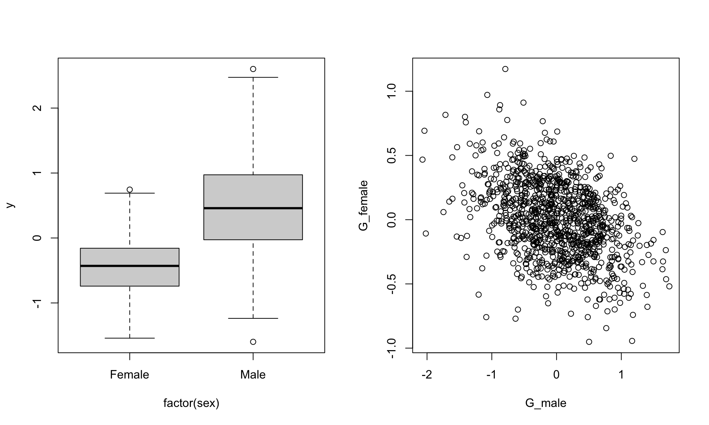

# Genetic effects {#animal}

This vignette assumes that you are generally happy with how the `sim_population()` function works.

## Additive genetics effects {#va}
In order to simulate breeding values (additive genetic effects), we can provide the `simulate_population()` function with the relatedness structure in the population. The simplest way to do this is providing a pedigree using the the `pedigree` argument (a genetic relatedness matrix could also be given to the `cov_str` argument). The input to this argument needs to be a list, and the name of the pedigree in the list links it with the item in the parameter list.

**NOTE** the `simulate_population` function has very little error checking of pedigree structure at the moment 

When simulating breeding values, **all** individuals in pedigree need to be in the data_structure and *vice versa*. Having unsampled individuals (for example the base population) can be achieved in the sampling stage (not implemented yet). 

Lets start by importing a pedigree

```r
library(MCMCglmm)
data(BTped)
head(BTped)
```

```
##    animal  dam sire
## 1 R187557 <NA> <NA>
## 2 R187559 <NA> <NA>
## 3 R187568 <NA> <NA>
## 4 R187518 <NA> <NA>
## 5 R187528 <NA> <NA>
## 6 R187945 <NA> <NA>
```

We can use this pedigree as a data_structure

```r
squid_data <- simulate_population(
  data_structure = BTped, 
 
  pedigree = list(animal=BTped),
  
  parameters =list(
    animal = list(
      vcov = 0.2
    ),
    residual = list(
      vcov = 0.5
    )
  )
)

data <- get_population_data(squid_data)
head(data)
```

```
##                   y animal_effect   residual  animal  dam sire squid_pop
## R187557  1.14113884    0.27282191  0.8683169 R187557 <NA> <NA>         1
## R187559  0.03346801    0.35796019 -0.3244922 R187559 <NA> <NA>         1
## R187568 -0.56407013   -0.02598051 -0.5380896 R187568 <NA> <NA>         1
## R187518  0.65999435    0.47562458  0.1843698 R187518 <NA> <NA>         1
## R187528 -0.05576888    0.24929916 -0.3050680 R187528 <NA> <NA>         1
## R187945 -0.61011638   -0.33503416 -0.2750822 R187945 <NA> <NA>         1
```

```r
# Ainv<-inverseA(BTped)$Ainv
# mod <- MCMCglmm(y~1, random=~ animal,data=data,ginverse=list(animal=Ainv),verbose=FALSE)
# summary(mod)
```


We might want to simulate repeated measurements to allow estimation of permanent environment effects. This is where being able to have something in the parameter list with a different name to the grouping factor is useful. In this way permanent environmental and additive genetic effects can be simulated in different parts of the parameter list, and linked to the same part of the data_structure.


```r
## make data structure with two observations per individual
ds <- data.frame(individual=rep(BTped[,1], 2))

squid_data <- simulate_population(
  data_structure = ds, 
  pedigree=list(animal=BTped),
  parameters = list(
    individual = list(
      vcov = 0.3
    ),
    animal = list(
      group="individual",
      vcov = 0.2
    ),
    residual = list(
      vcov = 0.5
    )
  )
)

data <- get_population_data(squid_data)
head(data)
```

```
##                   y individual_effect animal_effect    residual individual
## R187888  0.01020696     -0.2477738401   0.377913082 -0.11993228    R187557
## R187646 -0.63839217     -0.0007032285   0.174850109 -0.81253905    R187559
## R187330  0.01347281     -0.0821917366   0.054403988  0.04126056    R187568
## R187374 -1.12147800     -0.1123699443   0.346614744 -1.35572280    R187518
## R187225 -0.06709685      0.6892948600  -0.357196984 -0.39919472    R187528
## R187133 -1.10036324     -0.3270334353   0.009196374 -0.78252618    R187945
##         squid_pop
## R187888         1
## R187646         1
## R187330         1
## R187374         1
## R187225         1
## R187133         1
```

```r
# Ainv<-inverseA(BTped)$Ainv
# data$animal_id <- data$individual
# mod <- MCMCglmm(y~1, random=~ individual + animal_id,data=data,ginverse=list(animal_id=Ainv),verbose=FALSE)
# summary(mod)
```

## Multivariate genetic effects

We can simulate genetic effects affecting multiple phenotypes and the covariance between them, by specifying the number of response variables, and a covariance matrix, instead of only a variance.

```r
squid_data <- simulate_population(
  data_structure = BTped,
  pedigree = list(animal = BTped),
  n_response=2,
  parameters = list(
    animal = list(
      vcov = diag(2)

    ),
    residual = list(
      vcov = diag(2)
    )
  )
)

data <- get_population_data(squid_data)
head(data)
```

```
##                 y1          y2 animal_effect1 animal_effect2  residual1
## R187557  1.0498536  0.99911359      1.5538579     0.29484094 -0.5040043
## R187559  2.4038024  0.17754768      1.3908246     0.60434753  1.0129778
## R187568 -0.4330169  0.01933489      0.5873343    -0.34427107 -1.0203512
## R187518 -0.5699932  0.83640542     -0.2065690     0.59328999 -0.3634242
## R187528  1.3531016 -0.65915595      0.4161831    -0.40080982  0.9369184
## R187945  1.0216835  0.12231473     -0.2603361     0.04645542  1.2820196
##           residual2  animal  dam sire squid_pop
## R187557  0.70427265 R187557 <NA> <NA>         1
## R187559 -0.42679985 R187559 <NA> <NA>         1
## R187568  0.36360596 R187568 <NA> <NA>         1
## R187518  0.24311543 R187518 <NA> <NA>         1
## R187528 -0.25834613 R187528 <NA> <NA>         1
## R187945  0.07585931 R187945 <NA> <NA>         1
```

```r
# Ainv<-inverseA(BTped)$Ainv
# mod <- MCMCglmm(cbind(y1,y2)~1,random=~us(trait):animal, rcov=~us(trait):units,data=data,family=rep("gaussian",2),verbose=FALSE,ginverse=list(animal=Ainv))
# summary(mod)
```

<br>


## Sex specific genetic variance and inter-sexual genetic correlations


```r
ds <- data.frame(animal=BTped[,"animal"],sex=sample(c("Female","Male"),nrow(BTped), replace=TRUE))

squid_data <- simulate_population(
  parameters = list(
    sex=list(
      fixed=TRUE,
      names=c("female","male"),
      beta=c(-0.5,0.5)
    ),
    animal= list(
      names = c("G_female","G_male"),
      vcov =matrix(c(0.1,-0.1,-0.1,0.4), nrow=2, ncol=2 ,byrow=TRUE)
      ),
    residual = list(
      names="residual",
      vcov = 0.1
    )
  ),
  data_structure = ds,
  pedigree = list(animal=BTped),
  model = "y = female + male + I(female)*G_female + I(male)*G_male + residual"
)

data <- get_population_data(squid_data)
head(data)
```

```
##            y female male    G_female     G_male    residual  animal    sex
## 1 -0.7475234      1    0 -0.22124131  0.6854134 -0.02628208 R187557 Female
## 2  0.7622925      0    1 -0.22080327  0.3245153 -0.06222275 R187559   Male
## 3 -0.4513208      1    0 -0.02044484 -0.1496856  0.06912403 R187568 Female
## 4 -0.3446363      1    0  0.28449160 -0.3121034 -0.12912787 R187518 Female
## 5 -0.6826628      1    0  0.39759422 -0.7320171 -0.58025698 R187528 Female
## 6  1.2098620      0    1 -0.26679632  0.3800009  0.32986107 R187945   Male
##   squid_pop
## 1         1
## 2         1
## 3         1
## 4         1
## 5         1
## 6         1
```

```r
par(mfrow=c(1,2))
boxplot(y~factor(sex),data)
plot(G_female~G_male,data)
```


<br>

## GxE

```r
squid_data <- simulate_population(
  parameters = list(
    animal = list(
      names = c("G_int","G_slope"),
      mean =c(0,0.2), 
      vcov =matrix(c(1,0.3,0.3,0.5),ncol=2,nrow=2,byrow=TRUE)
    ),
    observation= list(
      names = c("environment"),
      vcov =c(1)
    ), 
    residual = list(
      names = c("residual"),
      vcov =c(0.5)
    )
  ),
  data_structure=rbind(BTped,BTped,BTped,BTped,BTped),
  pedigree = list(animal=BTped),
  model="y = G_int + G_slope * environment + residual"
)

data <- get_population_data(squid_data)
library(lme4)
short_summary <- function(x) print(summary(x), correlation=FALSE, show.resids=FALSE, ranef.comp = c("Variance"))

short_summary(lmer(y ~ environment + (1+environment|animal),data))
```

```
## Linear mixed model fit by REML ['lmerMod']
## Formula: y ~ environment + (1 + environment | animal)
##    Data: data
## 
## REML criterion at convergence: 14953.9
## 
## Random effects:
##  Groups   Name        Variance Corr
##  animal   (Intercept) 1.0236       
##           environment 0.4738   0.42
##  Residual             0.4878       
## Number of obs: 5200, groups:  animal, 1040
## 
## Fixed effects:
##             Estimate Std. Error t value
## (Intercept)  0.09127    0.03318   2.751
## environment  0.36888    0.02490  14.812
```

## Indirect Genetic Effects
Indirect genetic effects are a bit more difficult to code. Lets take the example of maternal genetic effects. The maternal genetic effect that affects an individual's phenotype, is that of its mother, not itself. Here we can use `[]` to index the levels of the random effects within the formula. This means that we can simulate the direct genetic and maternal genetic effects that an individual has (and the covariance between them), as well as generating an individual's phenotype from its own direct genetic effects, and its mother's maternal genetic effect.


```r
squid_data <- simulate_population(
  parameters=list(
    animal = list(
      names=c("direct","maternal"),
      vcov = matrix(c(1,0.3,0.3,0.5),2,2)
    ),
    residual = list(
      names="residual",
      vcov = 0.5
    )
  ),
  data_structure=BTped,
  pedigree=list(animal=BTped),
  model = "y = direct + maternal[dam] + residual"
)

data <- get_population_data(squid_data)

head(data)
```

```
##          y      direct   maternal   residual  animal  dam sire squid_pop
## R187557 NA  1.07831818 -0.3315485  1.1727157 R187557 <NA> <NA>         1
## R187559 NA  0.07314716  0.2372704  0.9301438 R187559 <NA> <NA>         1
## R187568 NA -2.26764967 -0.3177562 -0.3219078 R187568 <NA> <NA>         1
## R187518 NA -0.90911518 -1.3013741  0.2104976 R187518 <NA> <NA>         1
## R187528 NA -0.10891396  0.6543264 -0.4620404 R187528 <NA> <NA>         1
## R187945 NA -0.87079984 -0.1505844  0.1981661 R187945 <NA> <NA>         1
```


## Dominance
Coming soon...
<!--
Here we can make use of the dominance relatedness matrices that can be generated in the `nadiv` package

NOTE: not working fully yet!!! 
 
 -->

## Inbreeding depression
Coming soon...


## Genetic Groups
Coming soon...

