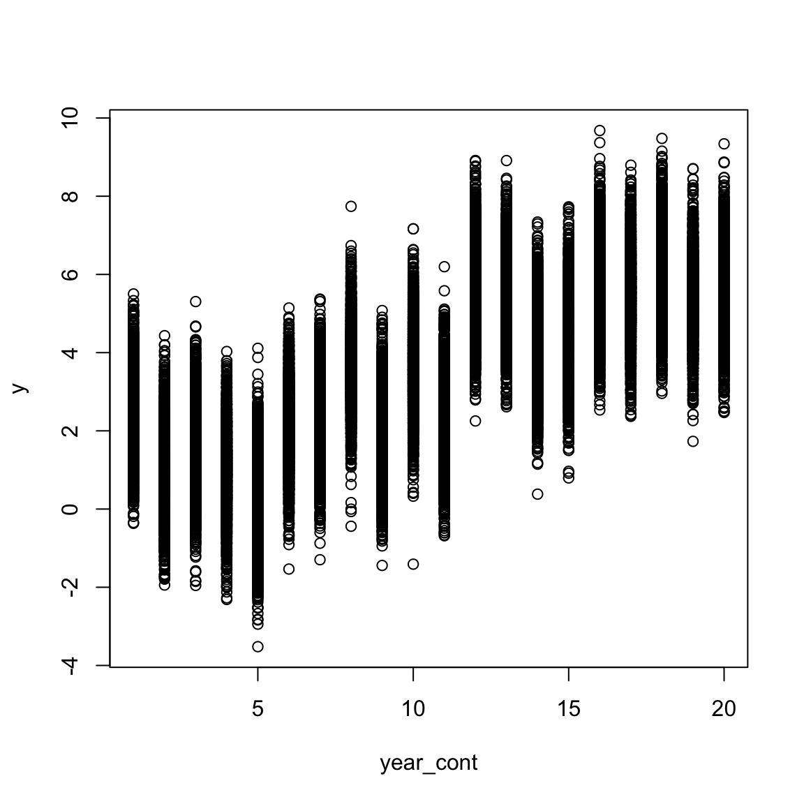
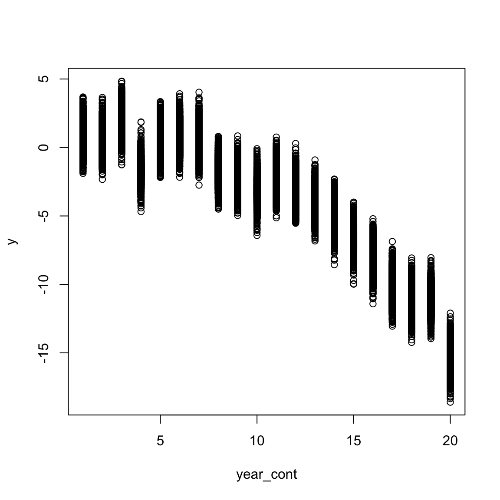
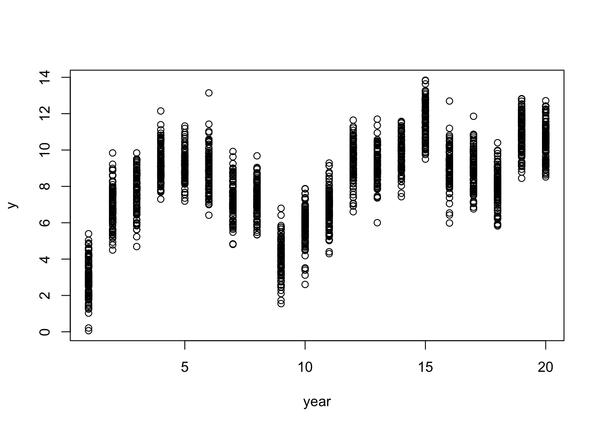

# Temporal and Spatial Effects

## Simple Temporal Effects

We might have measured a variable over the course of a certain time period (e.g. 20 years). We might expect that there is stochastic year-to-year variation, which we can simulate already. However we might also want to simulate patterns in that temporal data. We can treat the levels associated with a particular grouping factor (e.g. year) as both a factor and continuous.

To treat a grouping factor as continuous, we use `covariate=TRUE` in the parameter list. In this way we can simulate a linear effect of year:

``` r
squid_data <- simulate_population( 
  data_structure= make_structure(structure = "year(20) + sex(2)/individual(50)",repeat_obs=20),
  parameters=list(
    year_cont = list(
      group="year",
      names= "year_cont",
      covariate=TRUE,
      beta=0.3
    ),
    year = list(
      vcov = 0.8
    ),
    residual=list(
      vcov = 1
      )
    )
)
```

note we have specified `group` in the parameter list. This enables us to link a set of parameters to the grouping factor in the data structure. This doesn't have to be specified and defaults to the name of the list item.


``` r
data <- get_population_data(squid_data)
head(data)
```

```
##           y year_cont year_effect   residual year sex individual squid_pop
## 1 1.1436403         1     2.21821 -1.3745698    1   1          1         1
## 2 3.0559676         1     2.21821  0.5377575    1   1          1         1
## 3 4.2148492         1     2.21821  1.6966392    1   1          1         1
## 4 0.6152528         1     2.21821 -1.9029573    1   1          1         1
## 5 1.8172122         1     2.21821 -0.7009978    1   1          1         1
## 6 1.7139274         1     2.21821 -0.8042827    1   1          1         1
```

``` r
plot(y ~ year_cont, data)
```




Here we can see there is within year variation, year to year variation, as well as a linear directional year effect.

``` r
lmer(y ~ year_cont + (1|year), data)
```

```
## Linear mixed model fit by REML ['lmerMod']
## Formula: y ~ year_cont + (1 | year)
##    Data: data
## REML criterion at convergence: 113318.3
## Random effects:
##  Groups   Name        Std.Dev.
##  year     (Intercept) 0.9652  
##  Residual             0.9956  
## Number of obs: 40000, groups:  year, 20
## Fixed Effects:
## (Intercept)    year_cont  
##      0.5669       0.2838
```

In a similar way we can also simulate a quadratic effect of time.


``` r
squid_data <- simulate_population(
  data_structure = make_structure(structure = "year(20) + sex(2)/individual(50)",repeat_obs=20),
  parameters=list(
    year_cont = list(
      group="year",
      names= c("year_cont"),
      covariate=TRUE,
      beta=c(0.3)
    ),
    interactions=list(
      names= c("year_cont:year_cont"),
      beta=c(-0.05)
    ),
    year = list(
      vcov = 1
    ),
    residual=list(
      vcov = 0.8
    )
  )
)

data <- get_population_data(squid_data)

plot(y~year_cont,data)
```



<br>

## Cyclical Temporal Effects
The `squidR` function in the {squid} R package uses the sinusoidal equation to implement cyclical temporal effects:

<div class="alert alert-info">

$$
y = A sin(B(x - C)) + D
$$
</div>

 where A is the amplitude, $B/2\pi$ is the period $C/B$ is the horizontal shift and D is the vertical shift. We can visualise this


``` r
time <- 1:20

amplitude <- 10       # |A| = the amplitude
period <- 10
h_shift <- 3
v_shift <- 5

B <- (2*pi) / abs(period) # 2pi/|B| = the period 
cyclic_effect <- amplitude*sin(B*time - B^2*h_shift ) + v_shift

plot(cyclic_effect~time)
```


We can simulate this using the model part of the `simulate_population()`, adding the extra parameters for the cyclical effects into the year_cont part of the list.


``` r
squid_data <- simulate_population(
  data_structure= make_structure(structure = "year(20) + sex(2)/individual(50)",repeat_obs=1),

  parameters=list(
    year_cont = list(
      group="year",
      names= "linear_effect",
      covariate=TRUE,
      beta=0.3,
      amplitude = 2,       # |A| = the amplitude
      period = 10,
      h_shift = 3,
      v_shift = 5
    ),
    year = list(
      vcov = 1.2
    ),
    residual=list(
      vcov = 1
      )
    ), 

  model=" B =(2*pi) / abs(period);
          cyclic_effect = amplitude*sin(B*I(linear_effect) - B^2*h_shift ) + v_shift;
          y = linear_effect + cyclic_effect + year_effect + residual"
)

data <- get_population_data(squid_data)

plot(y~year,data)
```



## Temporal Autocorrelation {#temporalauto}


## Spatial Autocorrelation {#spatialauto}
