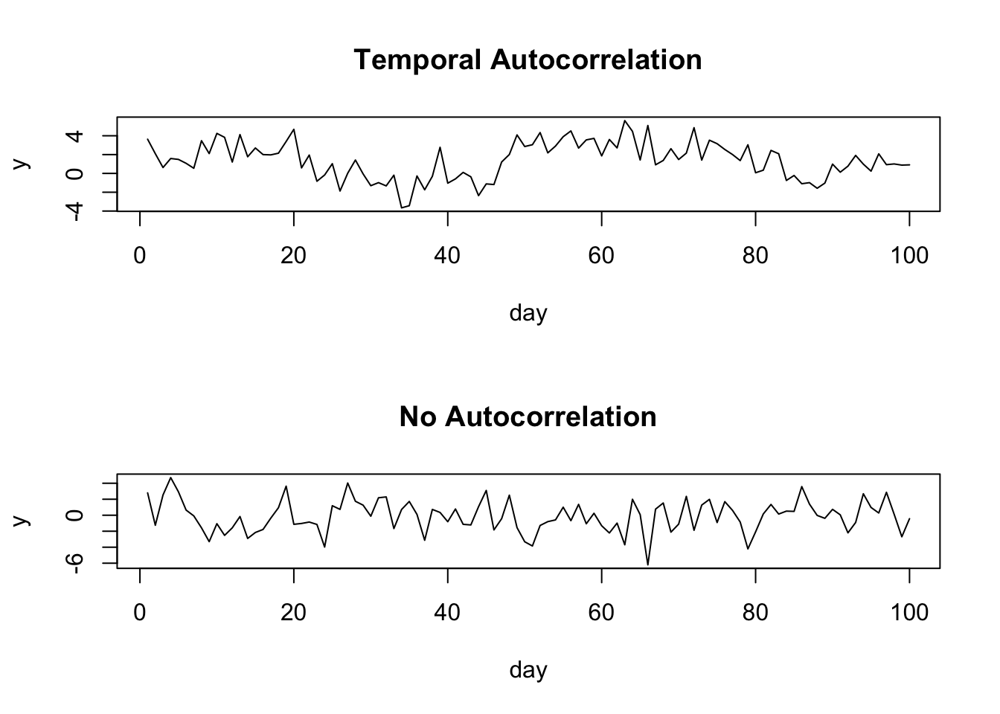
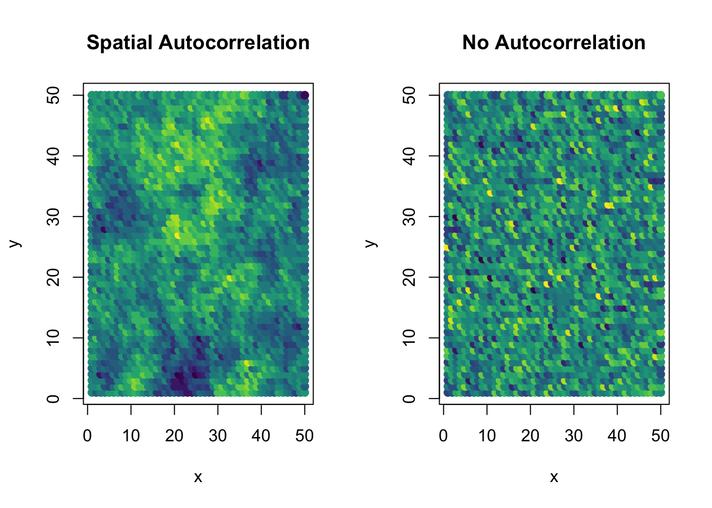
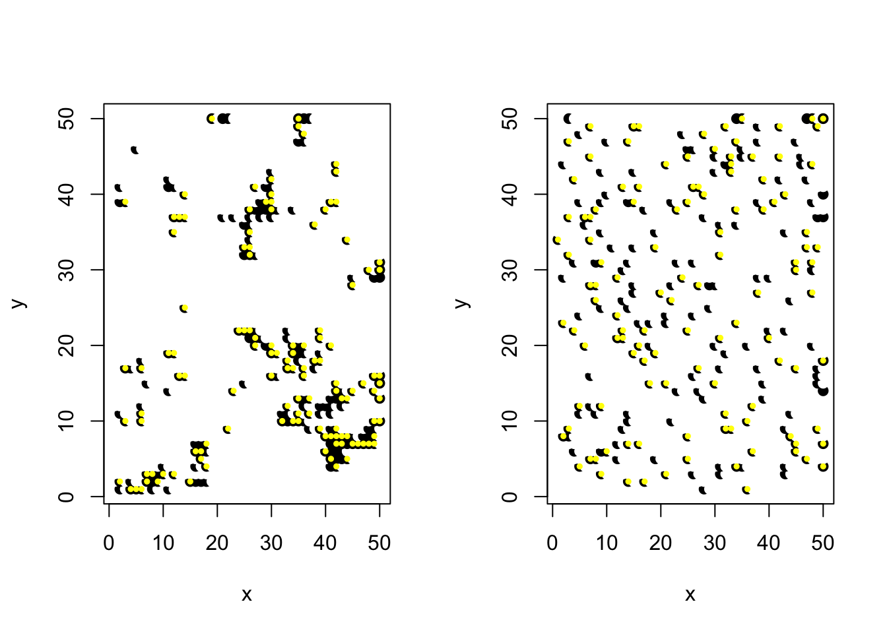

# Temporal and Spatial Effects

## Simple Temporal Effects

We might have measured a variable over the course of a certain time period (e.g. 20 years). We might expect that there is stochastic year-to-year variation, which we can simulate already. However we might also want to simulate patterns in that temporal data. We can treat the levels associated with a particular grouping factor (e.g. year) as both a factor and continuous.

To treat a grouping factor as continuous, we use `covariate=TRUE` in the parameter list. In this way we can simulate a linear effect of year:

``` r
squid_data <- simulate_population( 
  data_structure= make_structure(structure = "year(20) + sex(2)/individual(50)",repeat_obs=20),
  parameters=list(
    year_cont = list(
      group="year",
      names= "year_cont",
      covariate=TRUE,
      beta=0.3
    ),
    year = list(
      vcov = 0.8
    ),
    residual=list(
      vcov = 1
      )
    )
)
```

note we have specified `group` in the parameter list. This enables us to link a set of parameters to the grouping factor in the data structure. This doesn't have to be specified and defaults to the name of the list item.


``` r
data <- get_population_data(squid_data)
head(data)
```

```
##           y year_cont year_effect   residual year sex individual squid_pop
## 1 1.1436403         1     2.21821 -1.3745698    1   1          1         1
## 2 3.0559676         1     2.21821  0.5377575    1   1          1         1
## 3 4.2148492         1     2.21821  1.6966392    1   1          1         1
## 4 0.6152528         1     2.21821 -1.9029573    1   1          1         1
## 5 1.8172122         1     2.21821 -0.7009978    1   1          1         1
## 6 1.7139274         1     2.21821 -0.8042827    1   1          1         1
```

``` r
plot(y ~ year_cont, data)
```


Here we can see there is within year variation, year to year variation, as well as a linear directional year effect.

``` r
lmer(y ~ year_cont + (1|year), data)
```

```
## Linear mixed model fit by REML ['lmerMod']
## Formula: y ~ year_cont + (1 | year)
##    Data: data
## REML criterion at convergence: 113318.3
## Random effects:
##  Groups   Name        Std.Dev.
##  year     (Intercept) 0.9652  
##  Residual             0.9956  
## Number of obs: 40000, groups:  year, 20
## Fixed Effects:
## (Intercept)    year_cont  
##      0.5669       0.2838
```

In a similar way we can also simulate a quadratic effect of time.


``` r
squid_data <- simulate_population(
  data_structure = make_structure(structure = "year(20) + sex(2)/individual(50)",repeat_obs=20),
  parameters=list(
    year_cont = list(
      group="year",
      names= c("year_cont"),
      covariate=TRUE,
      beta=c(0.3)
    ),
    interactions=list(
      names= c("year_cont:year_cont"),
      beta=c(-0.05)
    ),
    year = list(
      vcov = 1
    ),
    residual=list(
      vcov = 0.8
    )
  )
)

data <- get_population_data(squid_data)

plot(y~year_cont,data)
```


<br>

## Cyclical Temporal Effects
The `squidR` function in the {squid} R package uses the sinusoidal equation to implement cyclical temporal effects:

<div class="alert alert-info">

$$
y = A sin(B(x - C)) + D
$$
</div>

 where A is the amplitude, $B/2\pi$ is the period $C/B$ is the horizontal shift and D is the vertical shift. We can visualise this


``` r
time <- 1:20

amplitude <- 10       # |A| = the amplitude
period <- 10
h_shift <- 3
v_shift <- 5

B <- (2*pi) / abs(period) # 2pi/|B| = the period 
cyclic_effect <- amplitude*sin(B*time - B^2*h_shift ) + v_shift

plot(cyclic_effect~time)
```


We can simulate this using the model part of the `simulate_population()`, adding the extra parameters for the cyclical effects into the year_cont part of the list.


``` r
squid_data <- simulate_population(
  data_structure= make_structure(structure = "year(20) + sex(2)/individual(50)",repeat_obs=1),

  parameters=list(
    year_cont = list(
      group="year",
      names= "linear_effect",
      covariate=TRUE,
      beta=0.3,
      amplitude = 2,       # |A| = the amplitude
      period = 10,
      h_shift = 3,
      v_shift = 5
    ),
    year = list(
      vcov = 1.2
    ),
    residual=list(
      vcov = 1
      )
    ), 

  model=" B =(2*pi) / abs(period);
          cyclic_effect = amplitude*sin(B*I(linear_effect) - B^2*h_shift ) + v_shift;
          y = linear_effect + cyclic_effect + year_effect + residual"
)

data <- get_population_data(squid_data)

plot(y~year,data)
```


## Temporal Autocorrelation {#temporalauto}


``` r
ar1_cor <- function(n, rho) {
  exponent <- abs(matrix(1:n - 1, nrow = n, ncol = n, byrow = TRUE) - 
      (1:n - 1))
  rho^exponent
}

temp_mat<-ar1_cor(n=100,rho=0.9)
colnames(temp_mat)<-rownames(temp_mat)<-1:100

ds <- data.frame(day=1:100)

sim_dat_ta<-simulate_population(
  seed=25,
  data_structure = ds,
  parameters = list(
    day = list(vcov=4),
    residual = list(vcov=1)
  ),
  cov_str = list(day=temp_mat)
)
dat_ta<-get_population_data(sim_dat_ta)
head(dat_ta)
```

```
##           y day_effect   residual day squid_pop
## 1 3.6334258   3.835942 -0.2025162   1         1
## 2 2.0960169   3.270739 -1.1747219   2         1
## 3 0.6243599   1.979511 -1.3551508   3         1
## 4 1.5844086   1.307931  0.2764777   4         1
## 5 1.4873109   1.145398  0.3419127   5         1
## 6 1.0725710   2.048936 -0.9763652   6         1
```

``` r
all(unique(ds$day) %in% rownames(temp_mat))
```

```
## [1] TRUE
```

``` r
sim_dat_no_ta<-simulate_population(
  seed=23,
  data_structure = ds,
  parameters = list(
    day = list(vcov=4),
    residual = list(vcov=1)
  )
)
dat_no_ta<-get_population_data(sim_dat_no_ta)


par(mfrow=c(2,1))
plot(y~day,dat_ta, type="l", main="Temporal Autocorrelation")
plot(y~day,dat_no_ta, type="l", main="No Autocorrelation")
```




## Spatial Autocorrelation {#spatialauto}

Spatial autocorrelation can be simulate by passing a spatial correlation matrix to the `cov_str` argument of `simulate_population()`.

First we need some kind of spatial autocorrelation matrix. This is a large correlation matrix, showing how close all the locations are to each other. We create different kinds of these. Here, we use the `corClasses` structures in the `nlme` package. To demonstrate, we generate a exponential spatial correlation matrix, with strong autocorrelation. 


``` r
library(nlme)
```

```
## 
## Attaching package: 'nlme'
```

```
## The following object is masked from 'package:lme4':
## 
##     lmList
```

```
## The following object is masked from 'package:dplyr':
## 
##     collapse
```

``` r
library(squidSim)

ds <- make_structure("location(2500)")
locations <- matrix(1:2500,nrow=50,ncol=50)
locations2<-as.data.frame(t(sapply(1:2500,function(x)which(locations==x, arr.ind=TRUE))))
colnames(locations2) <- c("x","y")

cs1Exp <- corExp(5, form = ~ x + y)
cs1Exp <- Initialize(cs1Exp, locations2)
spM<- corMatrix(cs1Exp)
colnames(spM) <- rownames(spM) <- 1:2500
```

We can feed this matrix into the `cor_str` argument of `simulate_population()`. Here we simulate with and without spatial autocorrelation to show the difference. 


``` r
sim_dat_auto<-simulate_population(
  seed=22,
  data_structure = ds,
  parameters = list(
    location = list(vcov=4),
    residual = list(vcov=1)
  ),
  cov_str = list(location=spM)
)
dat_auto<-get_population_data(sim_dat_auto)


sim_dat_no<-simulate_population(
  seed=27,
  data_structure = ds,
  parameters = list(
    location = list(vcov=4),
    residual = list(vcov=1)
  )
)
dat_no<-get_population_data(sim_dat_no)

library(viridis)
```

```
## Loading required package: viridisLite
```

```
## 
## Attaching package: 'viridis'
```

```
## The following object is masked from 'package:scales':
## 
##     viridis_pal
```

``` r
color_scale <- viridis(20)

dat_auto$y_group <- as.numeric(cut(dat_auto$y, breaks=20))
dat_no$y_group <- as.numeric(cut(dat_no$y, breaks=20))

par(mfrow=c(1,2))
plot(y~x,locations2, pch=19, col=color_scale[dat_auto$y_group], cex=1, main="Spatial Autocorrelation")
plot(y~x,locations2, pch=19, col=color_scale[dat_no$y_group], cex=1, main="No Autocorrelation")
```




### Example: Species occurrence data with spatial autocorrelation 


``` r
library(nlme)
library(squidSim)

ds <- make_structure("location(2500)")
locations <- matrix(1:2500,nrow=50,ncol=50)
locations2<-as.data.frame(t(sapply(1:2500,function(x)which(locations==x, arr.ind=TRUE))))
colnames(locations2) <- c("x","y")

cs1Exp <- corExp(3, form = ~ x + y)
cs1Exp <- Initialize(cs1Exp, locations2)
spM<- corMatrix(cs1Exp)
colnames(spM) <- rownames(spM) <- 1:2500
```


``` r
sim_dat<-simulate_population(
  seed=236,
  data_structure = ds,
  n_response=2,
  response_names = c("occurrence","observation"),
  parameters = list(
    intercept= c(-3,0),
    location = list(vcov=c(4,0)),
    # age=list(covariate=TRUE,  beta=matrix(c(-0.2,0),ncol=2)),
    residual=list(vcov=c(0,0))
  ),
  cov_str = list(location=spM),
  family= "binomial",
  link="probit"
)
dat<-get_population_data(sim_dat)
dat$seen <- dat$occurrence* dat$observation


sim_dat_R<-simulate_population(
  seed=224,
  data_structure = ds,
  n_response=2,
  response_names = c("occurrence","observation"),
  parameters = list(
    intercept= c(-3,0),
    residual=list(vcov=c(4,0))
  ),
  family= "binomial",
  link="probit"
)
dat_R<-get_population_data(sim_dat_R)
dat_R$seen <- dat_R$occurrence* dat_R$observation

par(mfrow=c(1,2))
plot(y~x,locations2, pch=19, col=dat$occurrence)
points(y~x,locations2[dat$seen==1,], pch=19, col="yellow", cex=0.5)

plot(y~x,locations2, pch=19, col=dat_R$occurrence)
points(y~x,locations2[dat_R$seen==1,], pch=19, col="yellow", cex=0.5)
```


