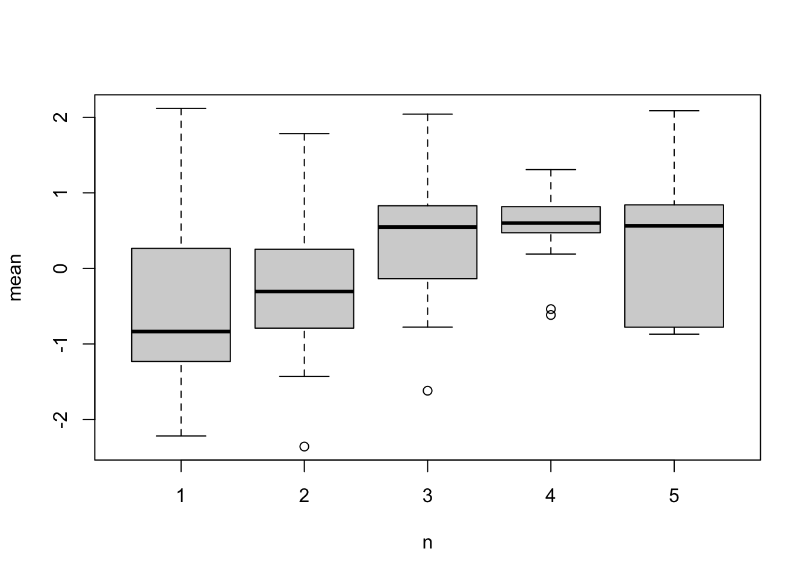

# Sampling  {#sampling}

To create different sampling schemes, we can use the sample arguments in the `simulate_population()` function, for example:

```r
  sample_type = "nested", 
  sample_param = cbind(individual=c(10, 15),observation=c(10, 5)),
```

There are three different types of sampling 'nested', 'missing' and 'temporal', each of which are outlined below.

The sample arguments create different datasets for each population that has been simulated, and you can then use the function `get_sample_data()` to extract the sampled data. 


## Nested

Nested sampling assumes that you have a nested structure, and allows you to sample different numbers at each hierarchical level. The `param` input is a matrix with (named) columns.  The rows of this matrix represent different sampling sets. This is most easily put together using the `cbind()` (column bind) function, specifying the names. The number of repeat observations for a higher level can be specified using name 'observation' (this doesn't have to exist in the data structure). For example


```r
cbind(individual=c(10, 15),observation=c(10, 5))
```

```
##      individual observation
## [1,]         10          10
## [2,]         15           5
```
 would represent sampling the data structure above, the first set having 10 individuals each with 10 observations

Note this sampling procedure only produces balanced sampling designs. For unbalanced designs see 'missing data' below.

### Worked example 1
We want to see how the number of repeat measurements on individuals affects power. In order to vary the number of observations of an individual, we could specify:


```r
param <- cbind(nest=10,individual=10,observation=c(20, 10, 5, 2))
```


```r
pop_data <- simulate_population(
  data_structure = make_structure("nest(10)/individual(20)",repeat_obs=20),

  parameters = list(
    individual = list( 
      vcov = 0.1
    ),
    observation= list(
      names = c("environment"),
      beta =c(0.5)
    ), 
    residual = list(
      vcov = 0.8
    )
  ),

  sample_type = "nested", 
  sample_param = param
)
```

To extract the sampled data we can then use `get_sample_data()` specifying which sample set we want, for example the second set 10 nests, each with 10 individuals with 10 observations:


```r
sample_data <- get_sample_data(pop_data, sample_set=2)
length(unique(sample_data$nest))
```

```
## [1] 10
```

```r
length(unique(sample_data$individual))
```

```
## [1] 100
```

```r
nrow(sample_data)
```

```
## [1] 1000
```

## Missing data
The missing data methods allows generation of unbalanced data. Missing data is generated through creating probabilities of being sampled using logistic regression. Missingness can then either be random, or a function of any of the simulated variables. 

This methods allows the different classes of missing data to be generated:

- **M**issing **C**ompletely **A**t **R**andom (MCAR)
    - All observations have an equal probability of being sampled
- **M**issing **A**t **R**andom (MAR)
    - Probability of missingness is dependent on variables correlated with the response variable (i.e. a predictor variable)
- **M**issing **N**ot **A**t **R**andom (MNAR)
    - Probability of missingness is dependent on the response variable itself 

<!--
Logistic function - probability of being sampled
	MNAR Y = beta_1 * body size
	MNAR Y = beta_1 * (temp +residual)
	MAR Y = beta_2*temp
-->

### MCAR
Missing completely at random occurs when the probability of missingness is not dependent on anything.  This can be implemented through a logistic regression, where only the intercept is specified:
$$ logit(p) = beta_0 $$

Note this intercept is on the logit scale, so 0 is equivalent to 0.5.


```r
pop_data <- simulate_population(
  data_structure = make_structure("individual(100)",repeat_obs=5),

  parameters = list(
    individual = list( 
      vcov = 0.1
    ),
    observation= list(
      names = c("environment"),
      beta =c(0.5)
    ), 
    residual = list(
      vcov = 0.8
    )
  ),

  sample_type = "missing", 
  sample_param = "0"
)

sample_data <- get_sample_data(pop_data)
nrow(sample_data)
```

```
## [1] 243
```

### MAR
Missing  at random occurs when the probability of missingness is dependent on a predictor variable (or a variables correlated with y). This can be implemented through a logistic regression, where the predictor variable(s) is a predictor(s) of y:
$$ logit(p) = beta_0 + beta_1*environment $$ 

```r
pop_data <- simulate_population(
  data_structure = make_structure("individual(100)",repeat_obs=5),

  parameters = list(
    individual = list( 
      vcov = 0.1
    ),
    observation= list(
      names = c("environment"),
      beta =c(0.5)
    ), 
    residual = list(
      vcov = 0.8
    )
  ),

  sample_type = "missing", 
  sample_param = "0.5*environment"
)

sample_data <- get_sample_data(pop_data)
nrow(sample_data)
```

```
## [1] 259
```
The predictor variables are scaled (mean 0, variance 1), so the slopes are directly comparable across traits, and intercept represents the mean (on the logit scale).

### MNAR
Missing not at random occurs when the probability of missingness is dependent on the response variable itself variable (i.e. y). This can be implemented through a logistic regression, where the predictor variable is y:
$$ logit(p) = beta_0 + beta_1*y $$ 
Again y is scaled.


```r
pop_data <- simulate_population(
  data_structure = make_structure("individual(100)",repeat_obs=5),

  parameters = list(
    individual = list( 
      vcov = 0.8
    ),
    observation= list(
      names = c("environment"),
      beta =c(0.1)
    ), 
    residual = list(
      vcov = 0.5
    )
  ),

  sample_type = "missing", 
  sample_param = "0.5*y"
)

sample_data <- get_sample_data(pop_data)
nrow(sample_data)
```

```
## [1] 244
```

Lets try and visualise this. We know there is lots f between individual variation, and we know sampling is based on phenotype, so we would expect an association between number of observations and phenotype:

```r
ind_data <- data.frame(
  n=as.vector(table(sample_data$individual)),
  mean=tapply(sample_data$y,sample_data$individual,mean)
  )
boxplot(mean~n,ind_data)
```



<!-- example of variation in sampling between individuals, but not related to phenotype - create an individual level variable with beta=0 (doesn't affect phenotype, and then do sampling based on that) -->


## Temporal Sampling

In the parameters we specify a list, with the temporal variable `time`, the grouping variable with which the temporal sampling occurs `group`, the between group variance (as a proportion) in sampling times `variance` and the within group sample size `n`:

```r
pop_data <- simulate_population(
  data_structure = make_structure("day(100) + individual(100)",repeat_obs=1),

  parameters = list(
    individual = list( 
      vcov = 0.1
    ),
    day=list(
    	covariate=TRUE, 
    	beta=0.4
    ), 
    residual = list(
      vcov = 0.8
    )
  ),

  sample_type = "temporal", 
  sample_param = list(
    time = c("day"), 
    group = c("individual"), 
    variance = c(0.1,0.2), 
    n=4), 
  
)

sample_data <- get_sample_data(pop_data)
```
