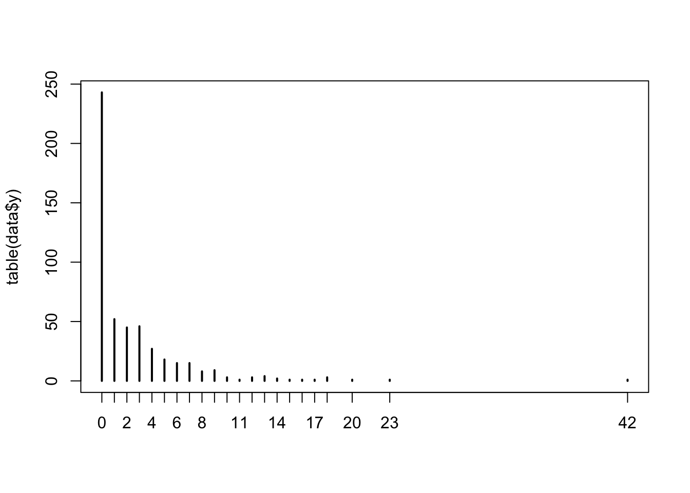

# Other model Types


## Double hierarchical models (DHGLMs)

### DHGLM


``` r
squid_data <- simulate_population(
  data_structure=make_structure("individual(50)",N=10),
  parameters = list(
    individual = list(
      names = c("ind_int","ind_slopes","ind_lnsd"),
      mean =c(0, 0, 0.5), 
      vcov = c(0.5, 0.1, 0.1),
      beta = c(1, 0, 0),
      functions=c(NA,NA,"exp") 
    ),
    observation =list(
      names="environment",
      beta=0.2
    ),
    residual = list(
      vcov = 1,
      beta = 0
    ),
    interactions = list(
      names = c("ind_slopes:environment","ind_lnsd:residual"),
      beta = c(1, 1)
    )
  )
)
```

### Bivariate DHGLM


``` r
squid_data <- simulate_population(
  n_response=2,
  parameters = list(
    individual = list(
      names = c("ind_int1","ind_slopes1","ind_lnsd1","ind_int2","ind_slopes2","ind_lnsd2"),
      mean =c(0, 0, 0.5,0,0,1), 
      vcov = c(0.5,0.1,0.1,0.4,0.2,0.05),
      beta = matrix(c( 1,0,
                       0,0,
                       0,0,
                       0,1,
                       0,0,
                       0,0
      ), byrow=TRUE,ncol=2),
      
      functions=c(NA,NA,"exp",NA,NA,"exp") 
    ),
    observation =list(
      names="environment",
      beta=matrix(c(0.2,-0.3),ncol=2)
    ),
    residual = list(
      names = c("residual1","residual2"),
      vcov = c(1,1),
      beta = matrix(c(0,0,0,0),ncol=2)
    ),
    interactions = list(
      names = c("ind_slopes1:environment","ind_lnsd1:residual1","ind_slopes2:environment","ind_lnsd2:residual2"),
      beta = matrix(c(1,1,0,0,0,0,1,1),byrow=TRUE,ncol=2)
    )
  ),
  data_structure=make_structure("individual(50)",N=10)
)
```


## Zero-inflated Poisson

squidSim doesn't generate zero-inflated data directly, but it can be easily made. For example, we can simulate a Poisson variable and a binomial variable, and multiply them together to get our zero-inflated response.


``` r
squid_data <- simulate_population(
  make_structure(structure = "mother(100)",repeat_obs=5),
  n_response = 2,
  response_names = c("reproduction","survival"),
  parameters=list(
    intercept = c(1,0),
    mother = list(
      vcov = matrix(c(
        0.25,0.15,
        0.15,1
        ),nrow=2,ncol=2,byrow=TRUE)
    ), 
    residual = list(
      vcov = matrix(c(
        0.25,0.15,
        0.15,1
        ),nrow = 2,ncol = 2,byrow=TRUE),
      beta = matrix(c(
        1,0,
        0,0
        ),nrow = 2,ncol = 2,byrow=TRUE)
    )
  ),
  family=c("poisson","binomial"), 
  link=c("log","probit")
)

data <- get_population_data(squid_data)
data$y <- data$survival * data$reproduction

head(data,10)
```

```
##    reproduction survival mother_effect1 mother_effect2    residual1  residual2
## 1             6        0      1.2400171     1.17829778 -0.687284900  0.1006170
## 2            23        1      1.2400171     1.17829778  0.848319584 -1.3063138
## 3            13        1      1.2400171     1.17829778 -0.350498912 -0.9775361
## 4             7        0      1.2400171     1.17829778 -0.872358752 -0.7551186
## 5             7        1      1.2400171     1.17829778  0.005561232 -0.7604861
## 6            10        1      0.3912797    -0.01031889  1.353984498  1.1636901
## 7             4        1      0.3912797    -0.01031889 -0.325840994  0.4764468
## 8             6        1      0.3912797    -0.01031889 -0.108594655  1.4663695
## 9            16        1      0.3912797    -0.01031889  1.264513662  0.7186276
## 10            6        1      0.3912797    -0.01031889  0.293968466 -0.3986855
##    mother squid_pop  y
## 1       1         1  0
## 2       1         1 23
## 3       1         1 13
## 4       1         1  0
## 5       1         1  7
## 6       2         1 10
## 7       2         1  4
## 8       2         1  6
## 9       2         1 16
## 10      2         1  6
```

``` r
plot(table(data$y))
```


